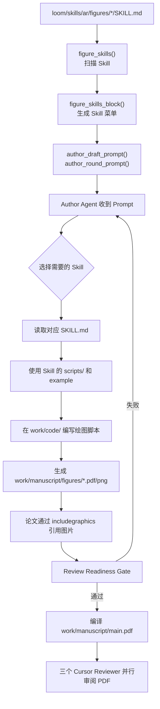

# Auto Research 画图 Skill 接入流程

本文用于 walk through `zhizhou-dev` 中论文画图 Skill 从“被发现”到“进入最终审稿 PDF”的完整流程。

## 1. 总览

当前实现可以概括为：

> **Prompt 软接入 + Author 主动执行 + Readiness Gate 硬验证 + PDF Reviewer 检查**



## 2. 第一步：Skill 存放位置

所有被 AR Author 暴露的相关 Skill 位于：

[`loom/skills/ar/figures/`](loom/skills/ar/figures/)

### 真正负责画图的四个 Skill

| Skill | 用途 | 入口 |
|---|---|---|
| `results-figure-1` | 实验结果、scaling、ablation 等测量图 | [`results-figure-1/SKILL.md`](loom/skills/ar/figures/results-figure-1/SKILL.md) |
| `results-figure-2` | 多 seed、per-trial、方差和分布图 | [`results-figure-2/SKILL.md`](loom/skills/ar/figures/results-figure-2/SKILL.md) |
| `teaser-figure-1` | 彩色三栏 problem/method/result 方法概览图 | [`teaser-figure-1/SKILL.md`](loom/skills/ar/figures/teaser-figure-1/SKILL.md) |
| `teaser-figure-2` | 白底会议风格 teaser，最后一栏使用真实测量图 | [`teaser-figure-2/SKILL.md`](loom/skills/ar/figures/teaser-figure-2/SKILL.md) |

同一目录下还有：

[`checkbib/SKILL.md`](loom/skills/ar/figures/checkbib/SKILL.md)

它负责核验引用，不负责画图。但当前 `figure_skills()` 会扫描该目录下所有 `SKILL.md`，所以它也会出现在 Author 的 Skill 菜单里。

## 3. 第二步：Python 自动发现 Skill

入口函数位于：

[`loom/ar_task.py`](loom/ar_task.py) → `figure_skills()`

核心逻辑：

```python
FIGURE_SKILLS_SUBDIR = "figures"

root = ar_skills_dir() / FIGURE_SKILLS_SUBDIR
for skill in sorted(root.iterdir()):
    doc = skill / "SKILL.md"
```

`figure_skills()` 会：

1. 定位 `loom/skills/ar/figures/`。
2. 遍历每个子目录。
3. 检查是否存在 `SKILL.md`。
4. 读取文件开头约 4,000 个字符。
5. 从 YAML frontmatter 中提取：
   - `name`
   - `description`
6. 返回名称、简短描述和绝对路径。

返回结构类似：

```python
{
    "name": "results-figure-1",
    "description": "Draw a results figure ...",
    "path": ".../loom/skills/ar/figures/results-figure-1/SKILL.md",
}
```

注意：此处不会把所有 Skill 的完整正文加载进 Prompt，只提取菜单信息。

## 4. 第三步：生成注入 Prompt 的 Skill 菜单

入口函数：

[`loom/ar_task.py`](loom/ar_task.py) → `figure_skills_block()`

它把发现的 Skill 组织成以下文本：

```text
Figure skills are installed. Read the SKILL.md before drawing ...

results-figure-1 - <description>
    <absolute path>/results-figure-1/SKILL.md

results-figure-2 - <description>
    <absolute path>/results-figure-2/SKILL.md

...
```

这意味着 Python 只告诉 Author：

- 有哪些 Skill；
- 每个 Skill 负责什么；
- 完整说明文件在哪里。

真正的绘图规范、脚本接口、配色和示例仍然保存在对应 `SKILL.md` 中。

## 5. 第四步：菜单注入 Author Prompt

`figure_skills_block()` 被注入两个关键 Prompt。

### Draft 阶段

[`loom/ar_task.py`](loom/ar_task.py) → `author_draft_prompt()`

```python
{figure_skills_block()}
```

Draft 阶段主要让 Author 知道后续可使用哪些画图能力。由于这一阶段只写论文骨架，图片通常仍保留为 `\ARfig{...}`。

### 正式 Author Round

[`loom/ar_task.py`](loom/ar_task.py) → `author_round_prompt()`

```python
{figure_skills_block()}
{stuck_block}
{feedback}
```

正式写作轮次中，Author 会同时收到：

1. AR Author 方法论；
2. Figure Skill 菜单；
3. Plateau 时的结构性修改要求；
4. 上一轮 Reviewer 的完整意见。

所以 Reviewer 如果指出缺少 Figure、图表不可读或证据不足，下一轮 Author 能从同一个 Prompt 中找到对应画图 Skill。

## 6. 第五步：Author 选择并读取 Skill

这里不是 Python 自动执行 `/results-figure-1`。

实际行为是：

1. Author 判断当前缺少哪类图片。
2. 根据 Prompt 中的菜单选择 Skill。
3. 使用文件读取工具打开对应 `SKILL.md`。
4. 查看 Skill 自带的 `scripts/`、示例代码和示例数据。
5. 在任务自己的代码仓库中实现绘图脚本。
6. 运行脚本生成矢量 PDF 或 PNG。

例如 `results-figure-1` 自带：

- [`scripts/plot_style.py`](loom/skills/ar/figures/results-figure-1/scripts/plot_style.py)
- [`example.py`](loom/skills/ar/figures/results-figure-1/example.py)
- [`example_data.json`](loom/skills/ar/figures/results-figure-1/example_data.json)
- [`example.png`](loom/skills/ar/figures/results-figure-1/example.png)

`teaser-figure-1` 自带：

- [`scripts/overview_style.py`](loom/skills/ar/figures/teaser-figure-1/scripts/overview_style.py)
- [`example.py`](loom/skills/ar/figures/teaser-figure-1/example.py)
- [`example.png`](loom/skills/ar/figures/teaser-figure-1/example.png)

## 7. 第六步：图片进入新的双 Repo 布局

当前 Paper Task 使用两个独立 Git repo：

```text
.RUD/<paper-task>/work/
├── code/          # 实验与绘图脚本
└── manuscript/    # LaTeX 论文
    ├── main.tex
    ├── sections/
    └── figures/   # 最终图片
```

布局定义在：

[`loom/ar_task.py`](loom/ar_task.py)

关键函数：

- `work_root()`
- `code_root()`
- `paper_root()`
- `init_paper_workspace()`

推荐的数据流：

```text
work/code/results.json
        ↓
work/code/plot_result.py
        ↓
work/manuscript/figures/result.pdf
        ↓
\includegraphics{figures/result}
```

### 当前已知路径不一致

部分 Figure Skill 仍写着旧布局：

```text
code/
latex/figs/
```

例如：

- [`results-figure-1/SKILL.md`](loom/skills/ar/figures/results-figure-1/SKILL.md)
- [`teaser-figure-2/SKILL.md`](loom/skills/ar/figures/teaser-figure-2/SKILL.md)

但 AR 当前真实路径是：

```text
work/code/
work/manuscript/figures/
```

因此 walk through 时需要特别留意：Skill 的绘图规范仍然有效，但其中旧的输出路径需要替换为 `../manuscript/figures/` 或对应绝对路径。

## 8. 第七步：Readiness Gate 强制验证图片完成

即使 Author 没有正确使用 Skill，Reviewer 也不会立刻收到未完成论文。

入口：

[`loom/ar_task.py`](loom/ar_task.py) → `review_readiness()`

图片相关检查包括：

### 8.1 不允许残留 `\ARfig`

`review_readiness()` 会扫描所有有效 LaTeX source，任何以下 marker 都会阻止 Review：

```text
\ARTODO
\ARnum
\ARfig
TODO
TBD
FIXME
XXX
??
```

### 8.2 `\includegraphics` 文件必须存在

入口：

[`loom/ar_task.py`](loom/ar_task.py) → `_missing_graphics()`

它解析：

```latex
\includegraphics[...]{figures/result}
```

然后检查对应的：

```text
.pdf
.png
.jpg
.jpeg
.eps
```

是否真实存在。

### 8.3 编译 PDF 中不能出现占位图

Readiness Gate 使用 `pypdf` 读取最终 PDF，检查是否仍然显示：

```text
FIGURE PLACEHOLDER
TODO
TBD
??
```

### 8.4 PDF 必须能干净编译

入口：

[`loom/ar_task.py`](loom/ar_task.py) → `build_pdf()`

缺图片、错误引用、LaTeX 报错或不可读取的 PDF 都会阻止进入 Reviewer。

## 9. 第八步：Reviewer 只看最终 PDF

只有 Readiness Gate 通过后才会调用：

[`loom/ar_task.py`](loom/ar_task.py) → `run_reviewer()`

流程：

1. 将编译后的 PDF 复制到隔离临时目录。
2. 临时目录中只放 `submission.pdf`。
3. 并行启动三个 Cursor Reviewer：
   - `gpt-5.6-sol-max`
   - `claude-fable-5-thinking-max`
   - `cursor-grok-4.5-high`
4. Reviewer 检查：
   - 图片是否清晰；
   - 标签是否可读；
   - 是否 clipping；
   - 图中数字是否支持 claim；
   - 图和 caption 是否一致。
5. 保存三份完整 Review。
6. 采用最低 Rating Reviewer 的整套评分作为本轮结果。

Reviewer 看不到绘图脚本和 LaTeX，只评价人类最终会看到的 PDF。

## 10. 建议 Walk Through 顺序

按以下顺序阅读代码：

1. [`loom/skills/ar/figures/`](loom/skills/ar/figures/)  
   先了解有哪些 Skill。

2. [`loom/ar_task.py`](loom/ar_task.py) → `figure_skills()`  
   看 Python 如何扫描目录。

3. [`loom/ar_task.py`](loom/ar_task.py) → `figure_skills_block()`  
   看菜单文本如何生成。

4. [`loom/ar_task.py`](loom/ar_task.py) → `author_draft_prompt()`  
   看 Draft 阶段如何注入。

5. [`loom/ar_task.py`](loom/ar_task.py) → `author_round_prompt()`  
   看正式写作轮次如何注入。

6. 任意一个画图 [`SKILL.md`](loom/skills/ar/figures/results-figure-1/SKILL.md)  
   跟进 Skill 的脚本、示例和输出规范。

7. [`loom/ar_task.py`](loom/ar_task.py) → `init_paper_workspace()`  
   确认双 repo 目录布局。

8. [`loom/ar_task.py`](loom/ar_task.py) → `review_readiness()`  
   看图片完成度如何硬门控。

9. [`loom/ar_task.py`](loom/ar_task.py) → `run_reviewer()`  
   看最终 PDF 如何进入三模型 Reviewer Panel。

## 11. 一句话总结

画图 Skill 本身不是 Python 自动调用的 pipeline node，而是一组动态暴露给 Author 的本地方法论与脚本模板；Author 主动读取和执行，Readiness Gate 确保图片真实落地，最终 Reviewer 只审阅编译后的 PDF。
