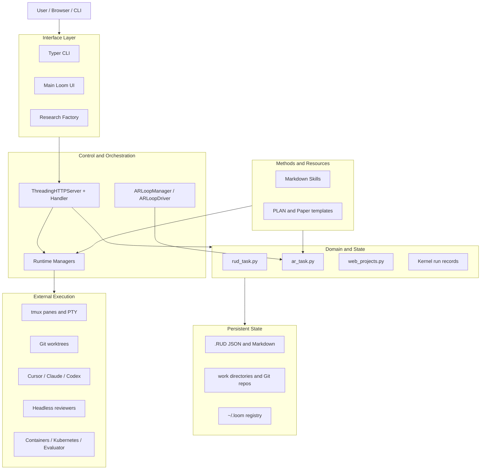
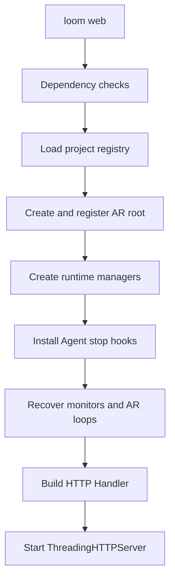
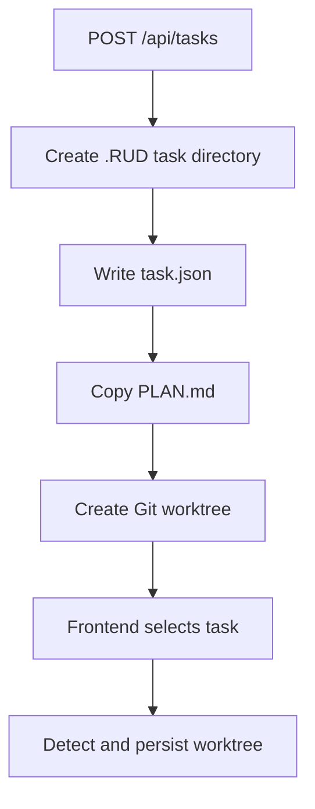
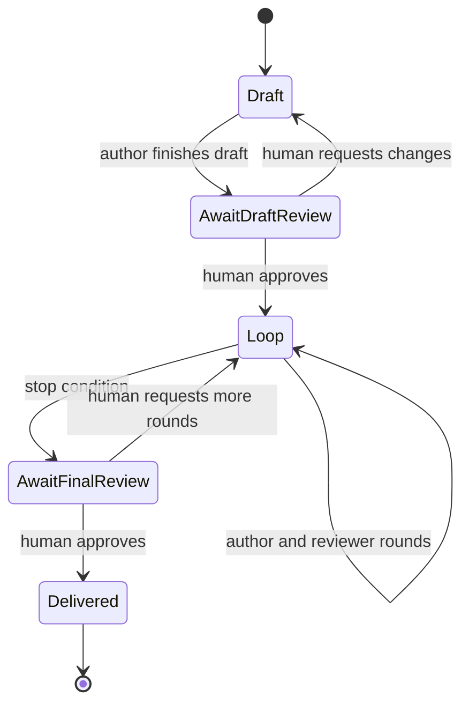
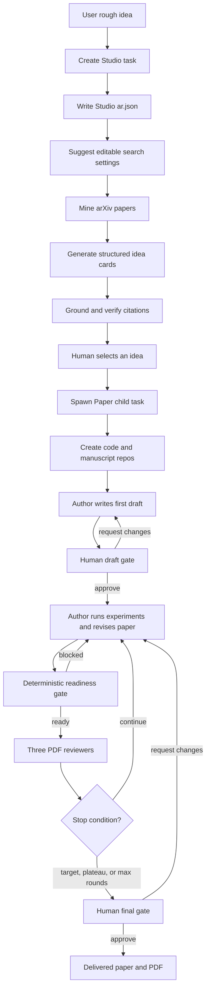

# Loom Codebase 分层架构解析

> 本文基于当前 `loom-zhongzhu` 代码快照，目标是回答两件事：
>
> 1. Loom 整体是用什么架构搭出来的；
> 2. 修改某一类功能时，应该沿着哪一层、哪些文件往下找。

## 0. 一句话结论

Loom 是一个 **Python 模块化单体控制面（modular monolith）**：

- 一个 Python 进程提供 CLI、HTTP API 和后台状态机；
- 业务状态主要写入 JSON、Markdown 和普通目录，而不是数据库；
- Agent 作为外部 Cursor / Claude / Codex CLI 运行在 tmux 中；
- Git worktree 隔离普通代码任务；
- 两套原生 JavaScript 前端共享同一个后端；
- Auto Research 和 Kernel Hub 是挂在通用任务控制面上的两个垂直子系统。

核心不是“让一个大 Agent 自己控制一切”，而是：

```text
确定性 Python 控制层
    + 文件状态
    + tmux/Git/外部 Agent 执行层
    + Markdown Skills 方法论
```

## 1. 总体层级



这个层级里最重要的边界是：

1. **Python 决定状态转换和何时执行**；
2. **Agent 负责完成开放式工作**；
3. **文件是跨进程、跨重启的交接协议**。

## 2. 仓库目录树

```text
loom-zhongzhu/
├── pyproject.toml
├── README.md
├── templates/
│   ├── PLAN.md
│   └── NOTES.md
├── scripts/
│
├── loom/
│   ├── __main__.py
│   ├── cli.py
│   ├── doctor.py
│   ├── paths.py
│   │
│   ├── web.py
│   ├── web_projects.py
│   ├── rud_task.py
│   ├── tmux_util.py
│   ├── agent_hooks.py
│   ├── openclaw.py
│   │
│   ├── ar_task.py
│   │
│   ├── web_static/
│   │   ├── index.html
│   │   ├── app.js
│   │   ├── app.css
│   │   ├── factory.html
│   │   ├── factory.js
│   │   ├── factory.css
│   │   └── vendor/
│   │
│   ├── skills/
│   │   ├── ar/
│   │   ├── dev/
│   │   ├── remote_control/
│   │   └── ...
│   │
│   ├── templates/paper/
│   │   ├── _shared/
│   │   ├── iclr/
│   │   ├── icml/
│   │   ├── neurips/
│   │   └── colm/
│   │
│   └── kernel_hub/
│       ├── kernel_evaluator/
│       ├── scaffold/
│       └── replacements/
│
└── tests/
    ├── test_rud_task.py
    ├── test_tmux_util.py
    ├── test_agent_hooks.py
    ├── test_activity_watcher.py
    ├── test_web_terminal_stream.py
    ├── test_ar_task.py
    ├── test_factory_search.py
    ├── test_review_panel_ui.py
    ├── test_kernel_task_storage.py
    └── ...
```

## 3. 第 0 层：包入口与配置

### 3.1 Python 包入口

[`pyproject.toml`](pyproject.toml) 定义：

```text
loom = loom.cli:app
```

因此：

```text
loom web
    → loom/cli.py:app
    → loom/cli.py:web_cmd()
    → loom/web.py:serve()
```

关键文件：

- [`loom/__main__.py`](loom/__main__.py)：支持 `python -m loom`；
- [`loom/cli.py`](loom/cli.py)：Typer 命令、参数解析、daemon 启动；
- [`loom/doctor.py`](loom/doctor.py)：检查 Python、Git、tmux、Agent CLI 和静态资源；
- [`loom/paths.py`](loom/paths.py)：统一定位内置 Skills、静态文件、AR Root 和 Kernel Hub。

### 3.2 最小依赖

Core Loom 的 Python 依赖很少：

- `typer`：CLI；
- `rich`：终端输出；
- `pypdf`：PDF 页数和文本读取。

Web 层没有使用 Flask、FastAPI 或 Django，而是直接使用 Python 标准库的 `ThreadingHTTPServer`。

Kernel Hub 是可选的大型子系统；[`pyproject.toml`](pyproject.toml) 明确将 `loom/kernel_hub/**` 排除在 wheel 之外。

## 4. 第 1 层：通用任务领域与文件状态

### 4.1 `rud_task.py` 是普通任务的领域中心

[`loom/rud_task.py`](loom/rud_task.py) 负责：

- `TaskMeta` 数据模型；
- 创建、读取、更新 `task.json`；
- 生成 slug；
- 创建任务目录；
- 初始化 `PLAN.md`；
- Git worktree 创建和发现；
- worktree diff、push、merge；
- Cursor / Claude / Codex 命令构造；
- Agent 原生 session 的发现；
- Task monitor 配置。

普通任务目录：

```text
<project>/.RUD/<slug>/
├── task.json
├── PLAN.md
├── monitor.json
└── work/
    └── <repo-name>/       # Git worktree
```

其中：

- `task.json` 回答“这个任务是什么、Agent 是谁、worktree 在哪”；
- `PLAN.md` 回答“任务现在做到哪里、下一步做什么”；
- Git 回答“代码真实发生了什么变化”。

### 4.2 项目注册表

[`loom/web_projects.py`](loom/web_projects.py) 的 `WebProjectRegistry` 管理：

```text
~/.loom/web-projects.json
```

注册项主要包含：

- Project ID；
- 显示名称；
- 磁盘路径；
- 默认项目；
- `codeRootPattern`。

每个 API 请求通过以下优先级决定 project scope：

```text
?project=<id>
    → X-Loom-Project header
    → default_project_id
```

### 4.3 路径配置

[`loom/paths.py`](loom/paths.py) 提供：

- `bundled_skills_path()`；
- `web_static_dir()`；
- `paper_templates_dir()`；
- `kernel_hub_dir()`；
- `ar_root()`。

Auto Research 默认存放在：

```text
~/ar
```

可用下面的环境变量覆盖：

```text
LOOM_AR_ROOT=/custom/path
```

## 5. 第 2 层：外部执行适配器

### 5.1 tmux

[`loom/tmux_util.py`](loom/tmux_util.py) 是 tmux 适配层，主要负责：

- `capture_pane()`：读取 pane 输出；
- `send_pane_text()`：向 pane 输入文字；
- `send_pane_key()`：发送按键；
- `open_pane_attach()`：创建 PTY 并连接浏览器终端。

Loom 不把 Agent 嵌入 Python 进程。它启动真实外部 CLI：

```text
Python Controller
    → tmux session
        → Cursor / Claude / Codex CLI
```

因此即使 Web 页面断开，Agent 和 tmux 仍然可以继续运行。

### 5.2 Agent Hooks

[`loom/agent_hooks.py`](loom/agent_hooks.py) 安装 Cursor/Claude Stop Hook。

方向是：

```text
Agent CLI
    → local stop hook
    → /api/activity/finished
    → AgentActivityWatcher
    → 前端完成提示
```

Hook 使用独立的：

```text
~/.loom/hook-token
```

它与 Web 登录 token 分离。

### 5.3 OpenClaw

[`loom/openclaw.py`](loom/openclaw.py) 的方向相反：

```text
Loom
    → OpenClaw gateway
    → 外部消息/通知
```

所以：

- Agent Hook 是 Agent 通知 Loom；
- OpenClaw 是 Loom 通知外部系统。

### 5.4 Git worktree

普通任务通过 Git worktree 隔离：

```text
source repository
    ├── main working tree
    └── .RUD/<task>/work/<repo>   # task worktree
```

主要逻辑仍在 [`loom/rud_task.py`](loom/rud_task.py)：

- `prepare_task_worktree_from()`；
- `detect_and_persist_worktree()`；
- `worktree_diff()`；
- `merge_worktree_to_base()`。

## 6. 第 3 层：Web 控制与运行时编排

### 6.1 `web.py` 是 composition root

[`loom/web.py`](loom/web.py) 是整个系统最大的编排文件。

它把下面所有组件装配到一起：

```text
WebProjectRegistry
ClaudeRegistry
TaskMonitorManager
AgentActivityWatcher
ARLoopManager
OpenClawClient
TerminalStreamRegistry
ThreadingHTTPServer
```

这里的 `ClaudeRegistry` 是历史命名；实际同时管理 Cursor、Claude 和 Codex。

### 6.2 启动过程

`serve()` 的主要过程：



### 6.3 手写路由

`make_handler()` 返回一个 `BaseHTTPRequestHandler` 子类。

路由全部集中在：

- `Handler.do_GET()`；
- `Handler.do_POST()`；
- `Handler.do_PUT()`；
- `Handler.do_DELETE()`。

主要 API 族：

```text
/api/projects                         项目
/api/tasks                            通用任务
/api/tasks/<slug>/...                 单任务
/api/tmux/...                         tmux 与终端
/api/activity/...                     Agent 活动
/api/ar/...                           Research Factory
/api/tasks/<slug>/ar/...              AR action
/api/kernel/...                       Kernel Lab
```

这种设计很直接，但也意味着：

- `web.py` 是主要耦合点；
- 修改 API contract 时要同时检查后端和两套前端；
- 新功能应尽量把领域逻辑放回 `rud_task.py`、`ar_task.py` 或 Kernel 模块，而不是继续堆在 Handler 中。

### 6.4 后台 Manager

#### `ClaudeRegistry`

负责：

- 创建/复用 tmux session；
- 构造 Agent 命令；
- 保存 tmux target；
- 粘贴 prompt；
- 恢复 Agent session；
- 判断 pane 是否存活。

#### `AgentActivityWatcher`

负责主 UI 的：

- Agent 正在运行；
- Agent 刚刚结束；
- 未读完成提示。

Stop Hook 优先，tmux 文本检测是 fallback。

#### `TaskMonitorManager`

用户启用 Notify 后，为 task 创建 `_TaskMonitor` 线程：

- 定期 capture pane；
- 判断 Agent 从 working 变为 stopped；
- 发送 OpenClaw 通知；
- 将配置写入 `monitor.json`。

#### `_TerminalStreamRegistry`

将浏览器的临时 `stream_id` 映射到 PTY 文件描述符，使浏览器 xterm 可以双向操作 tmux。

## 7. 第 4 层：两套前端

Loom 没有 React/Vue 构建系统；前端是原生 HTML、CSS、JavaScript。

### 7.1 主 Loom UI

文件：

- [`loom/web_static/index.html`](loom/web_static/index.html)；
- [`loom/web_static/app.js`](loom/web_static/app.js)；
- [`loom/web_static/app.css`](loom/web_static/app.css)；
- [`loom/web_static/vendor/`](loom/web_static/vendor/)。

负责：

- 项目切换；
- 普通 Task 创建和管理；
- Agent 启停与 Deep Interview；
- xterm 交互终端；
- Git diff/worktree；
- Notes；
- Kernel Lab；
- AR task 的紧凑视图。

终端不是 WebSocket，而是：

```text
Browser xterm
    ↔ long-lived HTTP byte stream
    ↔ PTY
    ↔ tmux attach
    ↔ Agent CLI
```

### 7.2 Research Factory

文件：

- [`loom/web_static/factory.html`](loom/web_static/factory.html)；
- [`loom/web_static/factory.js`](loom/web_static/factory.js)；
- [`loom/web_static/factory.css`](loom/web_static/factory.css)。

它是 AR 专用前端，分成：

```text
Fleet
    → Studio
        → Paper
```

主要能力：

- 查看全部 Studio/Paper/费用；
- arXiv Mining；
- 模型建议并编辑搜索词；
- Idea Cards；
- 知识图谱；
- 生成 Paper 子任务；
- Draft/Final Human Gate；
- Author/Reviewer rounds；
- 三模型 Review；
- 只读查看 Author tmux；
- 浏览实验与论文文件；
- PDF 构建和下载。

轮询：

- Fleet/global stats：约 6 秒；
- 当前 Studio/Paper：约 6 秒；
- Author tmux tail：开启 `live` 后约 2 秒。

Factory 的 tmux 视图是只读的；交互操作回到主 Loom UI。

## 8. 第 5 层：普通 Agent Task

### 8.1 创建流程



### 8.2 Agent 启动流程

```text
POST /api/tasks/<slug>/interview/start
    → ClaudeRegistry.start()
    → build_agent_command()
    → tmux new-session / respawn-pane
    → task.json 保存 tmux target
```

然后 Deep Interview prompt 是另一个动作：

```text
POST /api/tasks/<slug>/claude/paste-prompt
    → _build_claude_prompt()
    → 注入 goal + skills + worktree + PLAN.md 规则
    → send_pane_text()
```

“启动 Agent”和“发送任务 prompt”不是同一件事。

### 8.3 权威状态

普通任务最重要的三种真相：

```text
task.json   元数据真相
PLAN.md     任务进度真相
Git         代码变更真相
```

## 9. 第 6 层：Auto Research

### 9.1 AR 的代码边界

AR 由两部分组成：

1. [`loom/ar_task.py`](loom/ar_task.py)：领域逻辑；
2. [`loom/web.py`](loom/web.py) 中的 `ARLoopManager` / `_ARLoopDriver`：运行时驱动。

`ar_task.py` 负责：

- `ar.json`；
- Studio/Paper state；
- arXiv Mining；
- Search Suggestions；
- Idea generation；
- Citation grounding；
- Paper workspace；
- Prompt 构造；
- PDF 编译；
- Readiness Gate；
- 三模型 Reviewer Panel；
- plateau 判断；
- Human Gate；
- submission preparation。

### 9.2 Studio 流程


Studio 的长任务通过后台线程执行：

```text
POST action
    → _ar_run_async()
    → Python thread
    → 更新 ar.json
    → 写 ar-*.log
    → Factory 轮询展示
```

关键日志：

```text
ar-search.log
ar-papers.log
ar-ideas.log
```

### 9.3 Paper 目录

每个 Idea 生成独立 Paper task：

```text
<AR_ROOT>/.RUD/<paper-slug>/
├── task.json
├── ar.json
├── submission.json
├── rounds/
│   ├── round-00/
│   ├── round-01/
│   │   ├── author.md
│   │   ├── readiness.md
│   │   ├── review.md
│   │   └── review-<model>.md
│   └── ...
└── work/
    ├── code/              # 实验 Git repo
    └── manuscript/        # LaTeX Git repo + main.pdf
```

### 9.4 Paper 状态机



对应常量位于当前代码快照的
[`loom/ar_task.py:82-86`](loom/ar_task.py#L82-L86)：

```text
Line 82: STAGE_DRAFT = "draft"
Line 83: STAGE_AWAIT_DRAFT_REVIEW = "await_draft_review"
Line 84: STAGE_LOOP = "loop"
Line 85: STAGE_AWAIT_FINAL_REVIEW = "await_final_review"
Line 86: STAGE_DELIVERED = "delivered"
```

### 9.5 Author 与 Reviewer 的文件协议

Author 运行在 tmux 中。

Author 完成一轮的确定性信号不是终端说“完成了”，而是写入：

```text
rounds/round-NN/author.md
```

Controller 看到该文件后：

1. 编译 PDF；
2. 执行 `review_readiness()`；
3. 未通过则将同一轮退回 Author；
4. 通过后才运行 Reviewer；
5. 写入 Review 文件和 `ar.json`。

### 9.6 Reviewer Panel

Reviewer 是 Headless Cursor 子进程，不在 Author 的 tmux pane 中。

固定模型：

```text
gpt-5.6-sol-max
claude-fable-5-thinking-max
cursor-grok-4.5-high
```

三个 Reviewer：

- 并行运行；
- 只看到隔离后的编译 PDF；
- 分别保存完整报告；
- 用最低 Rating Reviewer 的整套评分作为最终判定。

### 9.7 Readiness Gate

Reviewer 之前的硬门控检查：

- LaTeX 是否可编译；
- PDF 是否存在且可读；
- TODO/占位符是否清除；
- Figure 是否真实存在；
- 引用是否解析；
- 章节是否完整；
- 页数和结构是否合理。

这保证 Reviewer 审的是“接近投稿”的论文，而不是半成品。

## 10. 第 7 层：Kernel Hub

Kernel Hub 是一个比 Core Loom 更重的子系统。

主要目录：

```text
loom/kernel_hub/
├── kernel_evaluator/
│   ├── api/
│   ├── services/
│   ├── models/
│   └── inliner/
├── scaffold/
│   ├── client/
│   ├── agent_runner/
│   ├── instructions/
│   └── multiagent/
└── replacements/
```

### 10.1 Loom 到 Kernel Hub

```text
Main UI Kernel Lab
    → /api/kernel/*
    → loom/web.py
    → rud_kernel.py JSON adapter
    → run_agents.sh / run_agents_k8s.sh
    → Agent containers or Pods
    → kernel evaluator
```

### 10.2 Evaluator 内部

Evaluator 负责：

- Run/Job 生命周期；
- 编译队列；
- Benchmark 队列；
- reference correctness；
- CUDA/HIP/Triton/CuTe builder；
- profile；
- 多 shape 聚合；
- Kernel Library。

与 Core Loom 不同，Kernel Evaluator 可以使用 PostgreSQL 和容器/Kubernetes 基础设施。

### 10.3 Kernel 的本地状态

Loom 在 task 下保存：

```text
.kernel-lab/
├── runs/
├── tasks/
├── contracts/
└── winners/
```

这些 JSON 记录让 Web 页面即使暂时无法连接 evaluator，也能展示已知状态。

## 11. 第 8 层：Markdown Skills 与模板

### 11.1 普通任务 Skills

普通任务通过 `TaskMeta.skills_path` 保存一个或多个 Skill 路径。

[`loom/web.py`](loom/web.py) 的 `_build_claude_prompt()`：

1. 读取 Skills；
2. 拼入 Agent 初始 prompt；
3. 加入 goal、worktree 和 `PLAN.md` 规则。

默认 Skill：

[`loom/skills/charlie_skills.md`](loom/skills/charlie_skills.md)

### 11.2 AR Skills

AR 按角色显式注入：

```text
AR-STUDIO.md
    → Studio prompt

AR-AUTHOR.md
    → Draft / Round prompt

AR-REVIEWER.md
    → Reviewer prompt
```

目录：

[`loom/skills/ar/`](loom/skills/ar/)

Figure Skills 位于：

[`loom/skills/ar/figures/`](loom/skills/ar/figures/)

Python 只将 Figure Skill 的名称、描述和路径组成菜单；Author 按需读取完整 `SKILL.md`，避免把所有方法一次性塞入上下文。

### 11.3 Paper Templates

[`loom/templates/paper/`](loom/templates/paper/)：

```text
_shared/    公共 section、bibliography、AR macros
iclr/       ICLR style
icml/       ICML style
neurips/    NeurIPS style
colm/       COLM style
```

`\ARTODO`、`\ARfig`、`\ARnum` 既是作者占位符，也是 Readiness Gate 的机器可检查哨兵。

## 12. 状态权威层级

| 状态类型 | 权威位置 | 负责模块 |
|---|---|---|
| 项目注册 | `~/.loom/web-projects.json` | `web_projects.py` |
| 普通任务元数据 | `.RUD/<slug>/task.json` | `rud_task.py` |
| 普通任务计划 | `.RUD/<slug>/PLAN.md` | Agent + `rud_task.py` |
| Git 变更 | task worktree 和 Git common dir | Git + `rud_task.py` |
| tmux 是否存活 | tmux server | `tmux_util.py` |
| Monitor 配置 | `.RUD/<slug>/monitor.json` | `web.py` / `rud_task.py` |
| AR 状态 | `.RUD/<slug>/ar.json` | `ar_task.py` |
| AR Round | `rounds/round-NN/` | Author / AR driver |
| Paper 源码 | `work/manuscript/` | Author |
| 实验代码 | `work/code/` | Author |
| Kernel Run | `.kernel-lab/runs/*.json` | `web.py` / Kernel adapter |
| UI 临时状态 | Python/Browser memory | `web.py` / JS |

要判断“谁说了算”，优先顺序是：

```text
外部真实资源
    Git / tmux / filesystem
        > task.json 中的索引字段
        > 浏览器内存中的显示状态
```

## 13. 测试层级

### 13.1 Core

- [`tests/test_doctor.py`](tests/test_doctor.py)
- [`tests/test_rud_task.py`](tests/test_rud_task.py)
- [`tests/test_project_code_root.py`](tests/test_project_code_root.py)
- [`tests/test_tmux_util.py`](tests/test_tmux_util.py)

### 13.2 Web 与 Agent

- [`tests/test_web_terminal_stream.py`](tests/test_web_terminal_stream.py)
- [`tests/test_web_conversation.py`](tests/test_web_conversation.py)
- [`tests/test_agent_hooks.py`](tests/test_agent_hooks.py)
- [`tests/test_activity_watcher.py`](tests/test_activity_watcher.py)

### 13.3 Auto Research

- [`tests/test_ar_task.py`](tests/test_ar_task.py)
- [`tests/test_factory_search.py`](tests/test_factory_search.py)
- [`tests/test_review_panel_ui.py`](tests/test_review_panel_ui.py)
- [`tests/test_hot_restart_skill.py`](tests/test_hot_restart_skill.py)

### 13.4 Kernel

- [`tests/test_kernel_task_storage.py`](tests/test_kernel_task_storage.py)
- [`loom/kernel_hub/scaffold/tests/test_scaffold_client.py`](loom/kernel_hub/scaffold/tests/test_scaffold_client.py)

## 14. 修改功能时从哪里进入

### 修改 CLI 或启动方式

从：

```text
loom/cli.py
    → loom/web.py:serve()
```

### 修改普通 Task / worktree

从：

```text
loom/rud_task.py
    → loom/web.py API
    → loom/web_static/app.js
```

### 修改 Agent/tmux

从：

```text
loom/tmux_util.py
    → ClaudeRegistry
    → /api/tmux/*
    → app.js xterm
```

### 修改 Research Factory

从：

```text
loom/ar_task.py
    → web.py:_ar_payload() / _ar_action()
    → ARLoopManager / _ARLoopDriver
    → factory.js
```

如果同时影响主 Loom 的 AR tab，还要检查：

```text
loom/web_static/app.js
loom/web_static/app.css
```

### 修改 Kernel Lab

从：

```text
web.py:_kernel_*
    → rud_kernel.py
    → scaffold/client/
    → kernel_evaluator/
```

### 修改 Agent 方法论

优先修改：

```text
loom/skills/
```

只有当“什么时候执行、状态如何转换、失败如何恢复”发生变化时，才修改 Python 控制层。

## 15. 架构优点

1. **状态透明**：绝大多数状态可直接查看 JSON/Markdown；
2. **容易恢复**：Web 重启后可从文件和 tmux 恢复；
3. **执行隔离**：普通任务用 Git worktree，AR Paper 用独立 code/manuscript repo；
4. **模型解耦**：控制层不依赖单一 Agent；
5. **人类 Gate 明确**：关键决策不会被自动提交；
6. **方法论可编辑**：Skills 是普通 Markdown；
7. **运维简单**：Core Loom 不需要数据库、队列服务或前端构建链。

## 16. 当前架构风险

1. **`web.py` 过大**：API、运行时 Manager 和多个领域的 glue code 集中在一个文件；
2. **前后端 contract 无 schema**：两个原生 JS 前端依赖手工保持一致；
3. **轮询较多**：Factory、主 UI、Activity、Monitor 都有独立轮询；
4. **单进程内后台线程**：非持久线程任务在重启时必须靠 stale-job sweep 修复；
5. **文件写入竞争**：需要持续保持原子写入和 merge-update 语义；
6. **外部 CLI 易漂移**：Agent session 路径、TUI 文本和命令参数可能随版本变化；
7. **Core 与 Kernel 复杂度差异很大**：Kernel Hub 的服务化架构不应继续塞回 Core Loom。

## 17. 最重要的三个控制文件

如果只想快速建立心智模型，按这个顺序读：

1. [`loom/web.py`](loom/web.py)
   看系统如何启动、路由、管理 tmux 和驱动后台状态机。

2. [`loom/rud_task.py`](loom/rud_task.py)
   看普通任务、`.RUD` 和 Git worktree 如何组织。

3. [`loom/ar_task.py`](loom/ar_task.py)
   看 Auto Research 的领域状态、Prompt、PDF、Readiness、Reviewer 和 Gate。

然后根据界面进入：

```text
主 Loom UI          → loom/web_static/app.js
Research Factory   → loom/web_static/factory.js
Kernel Lab         → loom/kernel_hub/
方法论              → loom/skills/
```

## 18. 最终心智模型

```text
Loom 不是一个单独的 AI Agent。

Loom 是一个确定性控制面：

    文件保存状态
    Python 决定状态转换
    tmux 承载 Agent
    Git 隔离代码
    Skills 定义方法
    Web UI 提供观察与人工 Gate

Auto Research 和 Kernel Hub
是在这套控制面上运行的两种专业工作流。
```

## 19. Studio：从一个 Idea 到一篇 Paper 的完整运行逻辑

这一节只追踪 Research Factory 的主链：

```text
用户有一个粗略 Idea
    → Studio 将其结构化为 Idea Cards
    → 用户选择一个 Idea Card
    → Loom 创建独立 Paper Task
    → Author 写 Draft
    → Human Draft Gate
    → Author/Reviewer 多轮循环
    → Human Final Gate
    → Delivered PDF
```

### 19.1 首先区分 Studio Task 和 Paper Task

这两个 Task 的角色不同：

| 类型 | 主要职责 | 是否有 Author tmux | 是否有论文目录 |
|---|---|---:|---:|
| Studio | 搜索文献、生成 Ideas、验证引用、选择研究方向 | 否 | 否 |
| Paper | 跑实验、写论文、编译 PDF、循环 Review | 是 | 是 |

Studio 的 Headless 模型调用不使用长期 tmux pane。

只有当用户选择一个 Idea 并执行 `Create papers` 后，Loom 才会创建真正的 Paper Task、独立工作目录和 Author tmux。

### 19.2 完整调用图



### 19.3 Step 0：用户创建 Studio

Factory 的入口代码：

- [`loom/web_static/factory.js`](loom/web_static/factory.js)：`btn-studio-create`；
- [`loom/web.py`](loom/web.py)：`POST /api/tasks`；
- [`loom/ar_task.py`](loom/ar_task.py)：`new_studio_state()`。

浏览器发送：

```text
POST /api/tasks
{
  title,
  kind: "ar",
  ar_direction,
  ar_custom_direction,
  ar_venue,
  ar_mode,
  ar_seed_idea,
  ar_max_rounds
}
```

后端依次执行：

```text
create_task()
    → 创建 .RUD/<studio-slug>/
    → 写 task.json
    → new_studio_state()
    → 写 ar.json
```

Studio 不创建普通代码 worktree，因为它的任务是组织研究方向，而不是直接修改代码。

#### Auto direction 与 My idea

`ar.json` 中的 `mode` 决定 Idea 生成方式：

```text
mode = auto
    先 Mining，再根据近期论文生成 Ideas

mode = seed
    从用户的 seed_idea 生成多个可检验变体
    即使没有 mined papers，也允许 Generate ideas
```

所以“我已经有一个 Idea”在当前 UI 中并不是立刻创建一篇 Paper。

它会先变成多个更具体的 Idea Cards，用户再决定哪一个值得投入实验资源。

### 19.4 Step 1：将研究 Brief 转成搜索设置

关键代码：

- [`loom/web_static/factory.js`](loom/web_static/factory.js)：`btn-search-suggest`；
- [`loom/web.py`](loom/web.py)：`_ar_search_suggest_job()`；
- [`loom/ar_task.py`](loom/ar_task.py)：`suggest_search_settings()`；
- [`loom/ar_task.py`](loom/ar_task.py)：`validate_search_settings()`。

数据流：

```text
Research brief
    → Headless Studio model
    → 3–5 个简短英文搜索词
    → arXiv category 白名单
    → 用户在 UI 中检查和修改
    → 保存进 Studio ar.json
```

这里有一个重要边界：

```text
Research brief ≠ arXiv query
```

Research brief 可以包含会议、目标和自然语言指令；真正的 query 只允许经过验证的短语和 category。

### 19.5 Step 2：Mining 文献

关键代码：

- [`loom/web_static/factory.js`](loom/web_static/factory.js)：`btn-mine`；
- [`loom/web.py`](loom/web.py)：`_ar_mine_job()`；
- [`loom/ar_task.py`](loom/ar_task.py)：`mine_papers()`；
- [`loom/ar_task.py`](loom/ar_task.py)：`_arxiv_query()`。

调用链：

```text
POST /api/tasks/<studio>/ar/mine
    → 验证 search_terms/search_categories
    → papers_status = running
    → _ar_run_async(_ar_mine_job)
    → 请求 arXiv Atom API
    → parse_arxiv_feed()
    → papers_status = done/error
    → papers 写入 Studio ar.json
```

Mining 是确定性 Python 网络任务，不是长期运行的 Agent。

运行日志：

```text
.RUD/<studio>/ar-papers.log
```

### 19.6 Step 3：将粗略 Idea 变成 Idea Cards

关键代码：

- [`loom/web_static/factory.js`](loom/web_static/factory.js)：`btn-ideas`；
- [`loom/web.py`](loom/web.py)：`_ar_ideas_job()`；
- [`loom/ar_task.py`](loom/ar_task.py)：`propose_ideas()`；
- [`loom/ar_task.py`](loom/ar_task.py)：`normalize_idea()`；
- [`loom/skills/ar/AR-STUDIO.md`](loom/skills/ar/AR-STUDIO.md)：Studio 方法论。

调用链：

```text
POST /api/tasks/<studio>/ar/ideas
    → _ar_ideas_job()
    → propose_ideas()
    → 读取 AR-STUDIO.md
    → 调用 Headless 模型
    → 解析 JSON Idea Cards
    → normalize_idea()
    → 写入 Studio ar.json: ideas[]
```

每个 Idea Card 的核心字段：

```text
id
title
hypothesis
novelty
metric
experiments[]
risk
score
derived_from[]
status
child_slug
```

这一步把：

```text
“我想做 image/video generation”
```

变成类似：

```text
明确机制
    + 可证伪假设
    + 对比基线
    + 主要指标
    + 最小实验
    + 风险
```

Idea generation 日志：

```text
.RUD/<studio>/ar-ideas.log
```

### 19.7 Step 4：Ground and verify

关键代码：

- [`loom/web_static/factory.js`](loom/web_static/factory.js)：`btn-link`；
- [`loom/web.py`](loom/web.py)：`_ar_link_job()`；
- [`loom/ar_task.py`](loom/ar_task.py)：`link_ideas()`；
- [`loom/ar_task.py`](loom/ar_task.py)：`verify_idea_edges()`。

`link_ideas()` 将 Idea 的 novelty claim 转换成结构化关系：

```text
extends
contradicts
combines
ports
controls-for
relates-to
```

然后 OpenAlex 验证：

- arXiv ID 是否真实存在；
- 标题是否匹配；
- 年份和基本 metadata；
- 模型声明的引用是否可能是伪造的。

结果写回：

```text
ideas[].derived_from[]
```

Factory 的 Knowledge Graph 就是根据这些 edges 绘制的。

注意：当前后端的 `spawn` action 只硬性要求 `idea_ids`，并不硬性要求 grounding 已完成；但标准 Studio 工作流应先 Ground，再创建 Paper。

### 19.8 Step 5：用户选择 Idea

关键代码：

- [`loom/web_static/factory.js`](loom/web_static/factory.js)：`S.picked`；
- [`loom/web_static/factory.js`](loom/web_static/factory.js)：`btn-spawn`；
- [`loom/web.py`](loom/web.py)：`action == "spawn"`。

Factory checkbox 只在浏览器中维护临时集合：

```text
S.picked = Set<idea_id>
```

用户点击 `Create papers` 后发送：

```text
POST /api/tasks/<studio>/ar/spawn
{
  idea_ids: [...]
}
```

这是整条流水线中的第一个明确资源决策：

```text
Idea Card 只是候选
用户勾选后才会变成真正的 Paper Task
```

### 19.9 Step 6：从 Idea 生成 Paper Child Task

关键代码：

- [`loom/web.py`](loom/web.py)：`_ar_spawn_children()`；
- [`loom/rud_task.py`](loom/rud_task.py)：`create_task()`；
- [`loom/ar_task.py`](loom/ar_task.py)：`child_slug()`；
- [`loom/ar_task.py`](loom/ar_task.py)：`init_paper_workspace()`；
- [`loom/ar_task.py`](loom/ar_task.py)：`seed_paper_skeleton()`；
- [`loom/ar_task.py`](loom/ar_task.py)：`new_paper_state()`。

`_ar_spawn_children()` 对每个选择的 Idea 执行：

```text
find_idea()
    → create_task(kind="ar")
    → child_slug(parent_slug, idea.title)
    → init_paper_workspace()
    → new_paper_state()
    → 写 child ar.json
    → parent idea.status = spawned
    → parent idea.child_slug = child slug
```

Paper slug 由 Studio slug 和 Idea title 组合，因此可以在扁平 `.RUD` 目录中恢复父子关系。

例如：

```text
wacv3
    → wacv3--modality-contrastive-decoding
```

### 19.10 Step 7：初始化两个独立 Git Repo

`init_paper_workspace()` 创建：

```text
<paper-task>/work/
├── code/
└── manuscript/
```

然后分别执行 Git init 和初始 commit：

```text
code/
    实验脚本、数据处理、评测和结果聚合

manuscript/
    LaTeX、bibliography、figures 和 main.pdf
```

这里不是从 Loom 源码 repo 创建 worktree。

每篇 Paper 自己拥有两个独立 Git repo，目的是：

1. 实验代码与论文源码职责分离；
2. 两边都能单独审查历史；
3. Paper Task 不绑定创建它的某个软件项目。

### 19.11 Step 8：初始化 Paper 状态机

`new_paper_state()` 写入：

```text
role = paper
parent_slug
idea
venue
stage = draft
round = 0
max_rounds
reviewer_models
loop_running = false
paper_dir
```

此时 Paper Task 已经存在，但 Author 还没有开始工作。

Factory Paper 页面读取：

```text
GET /api/tasks/<paper>/ar
```

后端通过：

- [`loom/web.py`](loom/web.py)：`_ar_payload()`；
- [`loom/ar_task.py`](loom/ar_task.py)：`available_actions()`。

决定哪些按钮可用。

### 19.12 Step 9：Start the draft

前端入口：

- [`loom/web_static/factory.js`](loom/web_static/factory.js)：`btn-loop-start`。

在 `stage = draft` 时，该按钮的真实 action 是：

```text
POST /api/tasks/<paper>/ar/draft
```

后端执行：

```text
确认 manuscript/main.tex 已存在
    → 必要时 seed_paper_skeleton()
    → ARLoopManager.start()
    → 创建 _ARLoopDriver thread
```

关键代码：

- [`loom/web.py`](loom/web.py)：`ARLoopManager.start()`；
- [`loom/web.py`](loom/web.py)：`_ARLoopDriver`；
- [`loom/web.py`](loom/web.py)：`ARLoopManager.ensure_pane()`。

### 19.13 Step 10：Author Agent 在 tmux 中工作

`ARLoopManager.ensure_pane()` 调用通用 `ClaudeRegistry.start()`：

```text
ARLoopManager
    → ClaudeRegistry
    → tmux session
    → Cursor / Claude Agent CLI
```

Author 使用的 prompt：

- [`loom/ar_task.py`](loom/ar_task.py)：`author_draft_prompt()`；
- [`loom/skills/ar/AR-AUTHOR.md`](loom/skills/ar/AR-AUTHOR.md)。

Author pane 的工作目录：

```text
<paper-task>/work/
```

因此 Agent 可以同时访问：

```text
./code
./manuscript
```

在 Factory Paper 页面中：

```text
The agent at work
    → 勾选 live
    → 每 2 秒 capture tmux 最近输出
```

对应前端代码：

- [`loom/web_static/factory.js`](loom/web_static/factory.js)：`renderPane()`；
- [`loom/web_static/factory.js`](loom/web_static/factory.js)：`pollPane()`；
- [`loom/tmux_util.py`](loom/tmux_util.py)：`capture_pane()`。

### 19.14 Step 11：Author 如何告诉 Controller “我完成了”

Author 不能只在终端里说“done”。

它必须写：

```text
rounds/round-00/author.md
```

路径由：

- [`loom/ar_task.py`](loom/ar_task.py)：`author_note_path()`；
- [`loom/ar_task.py`](loom/ar_task.py)：`round_dir()`。

生成。

`_ARLoopDriver._tick_draft()` 轮询这个文件。

发现后：

```text
build_pdf()
    → 记录 round-00 author summary
    → stage = await_draft_review
    → loop_running = false
    → 暂停等待人类
```

文件而不是终端文字是完成协议，所以：

- 浏览器断开不影响；
- Web 重启后可以恢复；
- pane 输出变化不会误判完成；
- Author 没有写 `author.md` 就不会进入下一步。

### 19.15 Step 12：Human Draft Gate

Factory 显示：

```text
Approve draft
Request changes
```

前端：

- [`loom/web_static/factory.js`](loom/web_static/factory.js)：`btn-gate-approve` / `btn-gate-reject`。

后端：

- [`loom/web.py`](loom/web.py)：`action == "gate"`；
- [`loom/ar_task.py`](loom/ar_task.py)：`record_gate()`。

状态转换：

```text
approve
    await_draft_review → loop
    自动启动 ARLoopManager

reject
    await_draft_review → draft
    将用户 note 带入下一次 Author prompt
```

Draft Gate 的目的不是评价最终论文，而是确认：

- 研究问题是否值得继续；
- Paper 结构和 claim 是否合理；
- 是否值得开始昂贵实验。

### 19.16 Step 13：开始正式 Author/Reviewer Round

进入 `stage = loop` 后：

```text
_ARLoopDriver._tick_loop()
    → _start_round(n)
    → ensure_round()
    → author_round_prompt()
    → prompt 粘入同一个 Author tmux
```

关键代码：

- [`loom/web.py`](loom/web.py)：`_tick_loop()`；
- [`loom/web.py`](loom/web.py)：`_start_round()`；
- [`loom/ar_task.py`](loom/ar_task.py)：`author_round_prompt()`。

Round prompt 会包含：

- 当前 Idea 和假设；
- 上一轮完整 Review；
- Human Gate note；
- 当前轮数和最大轮数；
- 实验与写作要求；
- Figure Skills；
- 必须清除 TODO、占位图和未解析引用；
- 完成后必须写当前轮 `author.md`。

### 19.17 Step 14：Author 完成一轮

Round N 的完成文件：

```text
rounds/round-NN/author.md
```

`_tick_loop()` 发现后调用：

```text
_close_round(state, n, author_note)
```

这是 Author 阶段与 Reviewer 阶段的分界。

### 19.18 Step 15：编译 PDF

`_close_round()` 首先调用：

- [`loom/ar_task.py`](loom/ar_task.py)：`build_pdf()`。

主要动作：

```text
latexmk
    → manuscript/main.tex
    → manuscript/main.pdf
```

Reviewer 不直接看工作中的 LaTeX 文件；后续输入以该 PDF 为准。

### 19.19 Step 16：Review Readiness Gate

关键代码：

- [`loom/ar_task.py`](loom/ar_task.py)：`review_readiness()`；
- [`loom/ar_task.py`](loom/ar_task.py)：`review_readiness_markdown()`；
- [`loom/web.py`](loom/web.py)：`_send_readiness_prompt()`；
- [`loom/ar_task.py`](loom/ar_task.py)：`author_readiness_repair_prompt()`。

Readiness 检查：

```text
PDF 编译和完整性
TODO / ARTODO / ARfig / ARnum
缺失 Figure
未解析引用
关键 Section
真实结果和数值
页数及基础结构
```

#### 未通过

```text
readiness-attempt-NN.md
author-attempt-NN.md
```

会被保存。

Controller 将确定性失败列表发回同一个 Author，要求继续修复当前 Round。

此时：

```text
不会调用任何 Reviewer
不会消耗 Reviewer turn
不会增加 round number
```

#### 通过

写入：

```text
rounds/round-NN/readiness.md
```

然后才进入 Reviewer Panel。

### 19.20 Step 17：三模型 PDF Reviewer

关键代码：

- [`loom/ar_task.py`](loom/ar_task.py)：`run_reviewer()`；
- [`loom/skills/ar/AR-REVIEWER.md`](loom/skills/ar/AR-REVIEWER.md)；
- [`loom/web.py`](loom/web.py)：`_ar_store_panel_reviews()`。

三个固定 Reviewer：

```text
gpt-5.6-sol-max
claude-fable-5-thinking-max
cursor-grok-4.5-high
```

运行方式：

```text
Author tmux: 不参与

Controller
    → 创建隔离 Reviewer workspace
    → 复制 submission.pdf
    → 并行启动三个 Headless Cursor Reviewer
    → 收集三份完整报告
```

输出：

```text
rounds/round-NN/review.md
rounds/round-NN/review-gpt-5.6-sol-max.md
rounds/round-NN/review-claude-fable-5-thinking-max.md
rounds/round-NN/review-cursor-grok-4.5-high.md
```

最终评分策略：

```text
选择 Rating 最低的 Reviewer
    → 使用该 Reviewer 的整套 scores
    → deciding_model 写入 ar.json
```

不是平均分，也不是多数投票。

### 19.21 Step 18：决定继续还是停止

每轮 Review 后，Controller 更新：

```text
ar.json.rounds[]
cost_usd
best_rating
plateau_started_round
stop_reason
```

停止条件：

1. 最低 Reviewer Rating 达到目标；
2. 达到 `max_rounds`；
3. Rating 进入 plateau，结构性修复后仍无提升。

关键代码：

- [`loom/ar_task.py`](loom/ar_task.py)：`should_stop_early()`；
- [`loom/ar_task.py`](loom/ar_task.py)：`update_plateau_tracking()`；
- [`loom/ar_task.py`](loom/ar_task.py)：`should_pause_for_plateau()`；
- [`loom/ar_task.py`](loom/ar_task.py)：`loop_is_complete()`；
- [`loom/web.py`](loom/web.py)：`_close_round()`。

如果不停止：

```text
上一轮 Review
    → author_round_prompt(next round)
    → 同一个 Author tmux
    → 新实验/修改
```

如果停止：

```text
stage = await_final_review
loop_running = false
```

### 19.22 Step 19：Human Final Gate

Factory 再次显示：

```text
Approve and deliver
Request changes
```

状态转换：

```text
approve
    await_final_review → delivered
    重新 build 最终 PDF

reject
    await_final_review → loop
    增加后续轮次预算
    将 Human note 带给 Author
```

Loom 不会自动替用户投稿。

`Prepare submission` 只会：

- 检查 submission metadata；
- 生成 `submission.json`；
- 生成 OpenReview 命令或 checklist；
- 等待用户自己登录并提交。

### 19.23 最终产物在哪里

论文源码：

```text
<AR_ROOT>/.RUD/<paper-slug>/work/manuscript/
```

最终 PDF：

```text
<AR_ROOT>/.RUD/<paper-slug>/work/manuscript/main.pdf
```

实验：

```text
<AR_ROOT>/.RUD/<paper-slug>/work/code/
```

控制状态：

```text
<AR_ROOT>/.RUD/<paper-slug>/ar.json
```

轮次审计：

```text
<AR_ROOT>/.RUD/<paper-slug>/rounds/
```

### 19.24 哪些组件在 tmux，哪些不在

| 组件 | tmux | 运行方式 |
|---|---:|---|
| Studio Search Suggestion | 否 | Headless Claude subprocess |
| arXiv Mining | 否 | Python background thread + HTTP |
| Idea Generation | 否 | Headless Claude subprocess |
| Ground and Verify | 否 | Headless model + OpenAlex |
| Paper Author | 是 | Cursor/Claude Agent CLI in tmux |
| Readiness Gate | 否 | Deterministic Python |
| 三个 Reviewer | 否 | Headless Cursor subprocesses |
| Human Gate | 否 | Web action + `ar.json` transition |

因此在 Factory 里看到的 Author `live` pane，只代表 Paper Author。

Studio 的 Mining/Ideas，以及后面的 Reviewers，都要看各自的 job log 和状态字段。

### 19.25 状态文件之间如何交接

```text
Studio ar.json
    ideas[].child_slug
        ↓
Paper task.json + Paper ar.json
        ↓
Author writes round-NN/author.md
        ↓
Controller writes readiness.md
        ↓
Reviewers write review*.md
        ↓
Controller updates Paper ar.json
        ↓
Factory polls and renders
```

最关键的原则：

```text
Agent 通过文件报告工作结果
Python 通过 ar.json 决定下一步
UI 只读取和触发，不是状态真相
```

### 19.26 从 Idea 到 Paper 的代码链接索引

| 阶段 | 前端入口 | Web 编排 | 领域逻辑/方法 |
|---|---|---|---|
| 创建 Studio | [`factory.js`](loom/web_static/factory.js) `btn-studio-create` | [`web.py`](loom/web.py) `POST /api/tasks` | [`ar_task.py`](loom/ar_task.py) `new_studio_state()` |
| 搜索建议 | [`factory.js`](loom/web_static/factory.js) `btn-search-suggest` | [`web.py`](loom/web.py) `_ar_search_suggest_job()` | [`ar_task.py`](loom/ar_task.py) `suggest_search_settings()` |
| Mining | [`factory.js`](loom/web_static/factory.js) `btn-mine` | [`web.py`](loom/web.py) `_ar_mine_job()` | [`ar_task.py`](loom/ar_task.py) `mine_papers()` |
| 生成 Ideas | [`factory.js`](loom/web_static/factory.js) `btn-ideas` | [`web.py`](loom/web.py) `_ar_ideas_job()` | [`ar_task.py`](loom/ar_task.py) `propose_ideas()` |
| Ground | [`factory.js`](loom/web_static/factory.js) `btn-link` | [`web.py`](loom/web.py) `_ar_link_job()` | [`ar_task.py`](loom/ar_task.py) `link_ideas()` |
| 选择 Idea | [`factory.js`](loom/web_static/factory.js) `S.picked` | — | Studio `ar.json: ideas[]` |
| 创建 Paper | [`factory.js`](loom/web_static/factory.js) `btn-spawn` | [`web.py`](loom/web.py) `_ar_spawn_children()` | [`ar_task.py`](loom/ar_task.py) `new_paper_state()` |
| 初始化目录 | — | `_ar_spawn_children()` | [`ar_task.py`](loom/ar_task.py) `init_paper_workspace()` |
| 启动 Draft | [`factory.js`](loom/web_static/factory.js) `btn-loop-start` | [`web.py`](loom/web.py) `ARLoopManager.start()` | [`ar_task.py`](loom/ar_task.py) `author_draft_prompt()` |
| Author tmux | [`factory.js`](loom/web_static/factory.js) `pollPane()` | [`web.py`](loom/web.py) `ClaudeRegistry.start()` | [`tmux_util.py`](loom/tmux_util.py) |
| Draft 完成 | — | [`web.py`](loom/web.py) `_tick_draft()` | `round-00/author.md` |
| Draft Gate | [`factory.js`](loom/web_static/factory.js) gate buttons | [`web.py`](loom/web.py) `action == "gate"` | [`ar_task.py`](loom/ar_task.py) `record_gate()` |
| Author Round | Paper Rounds UI | [`web.py`](loom/web.py) `_start_round()` | [`ar_task.py`](loom/ar_task.py) `author_round_prompt()` |
| Readiness | Readiness/loop status | [`web.py`](loom/web.py) `_close_round()` | [`ar_task.py`](loom/ar_task.py) `review_readiness()` |
| Reviewer | Review cards/modal | [`web.py`](loom/web.py) `_ar_store_panel_reviews()` | [`ar_task.py`](loom/ar_task.py) `run_reviewer()` |
| Stop 判断 | Pipeline/score chart | [`web.py`](loom/web.py) `_close_round()` | `should_stop_early()` / `should_pause_for_plateau()` |
| Final Gate | [`factory.js`](loom/web_static/factory.js) gate buttons | [`web.py`](loom/web.py) `action == "gate"` | [`ar_task.py`](loom/ar_task.py) `record_gate()` |
| Final PDF | Download PDF | [`web.py`](loom/web.py) `_ar_resolve_pdf()` | [`ar_task.py`](loom/ar_task.py) `build_pdf()` |

### 19.27 最短阅读顺序

如果只想理解 Studio 主链，建议按这个顺序阅读：

1. [`loom/web_static/factory.js`](loom/web_static/factory.js)
   先看用户按钮发出了什么 action。

2. [`loom/web.py`](loom/web.py) 的 `_ar_action()`
   看 action 如何进入同步操作、后台线程或 `ARLoopManager`。

3. [`loom/web.py`](loom/web.py) 的 `_ar_spawn_children()`
   看 Idea 如何真正变成 Paper child task。

4. [`loom/ar_task.py`](loom/ar_task.py) 的 `new_studio_state()` 与 `new_paper_state()`
   对比两类 `ar.json`。

5. [`loom/web.py`](loom/web.py) 的 `_ARLoopDriver`
   看 Draft、Round、Readiness、Reviewer 和 Gate 的调度。

6. [`loom/ar_task.py`](loom/ar_task.py) 的 Author/Reviewer Prompt 函数
   看每个模型实际收到什么指令。

7. [`loom/skills/ar/`](loom/skills/ar/)
   看 Studio、Author、Reviewer 的方法论来源。
