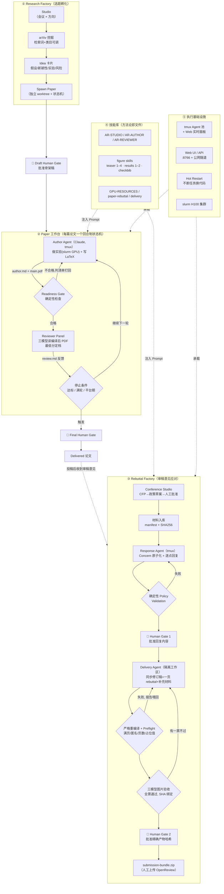

# Loom Auto Research System — 设计文档

> 一句话定位：**用确定性的 Python 状态机驾驭一群 LLM Agent，从"选题 → 做实验 → 写论文 →
> 多模型评审 → 修改迭代 → 交付"以及"收到审稿意见 → 写 rebuttal → 修订终稿"全流程自动化，
> 人只在少数关键 Gate 上做决策。**

---

## 0. 总图



---

## 1. 三条设计原则

1. **确定性与创造性分离。** 所有"流程决策"（何时评审、何时打回、何时停、允许谁批准什么）都由
   Python 状态机做，落盘为 JSON 状态；所有"内容创造"（实验、写作、画图、回复审稿人）都交给
   LLM Agent。模型的输出永远要经过代码的确定性校验才能推进状态。
2. **一切产物落盘、哈希绑定、可审计。** 每一轮的作者笔记、评审报告、readiness 报告都是磁盘文件；
   人工批准绑定的是**内容摘要/PDF 的 SHA-256**，而不是"当时看到的样子"——批准后任何改动都会让
   批准自动失效并要求重跑。
3. **分层门禁，人只守关键关口。** 便宜的确定性检查最先跑，昂贵的多模型评审其次，人工批准只出现
   在四个地方：论文骨架（Draft Gate）、论文定稿（Final Gate）、rebuttal 内容（Gate 1）、
   最终提交产物（Gate 2）。系统从不自动向会议系统投稿。

---

## 2. 模块一：Research Factory（选题孵化）

| 要素 | 说明 |
|---|---|
| Studio | 一个"会议 × 研究方向"的容器（如 `wacv3` × multimodal），持有检索设置与 idea 池 |
| arXiv 挖掘 | 按可编辑的检索词 + 类目抓论文；检索设置可让模型先"建议"，人再改 |
| Idea 卡片 | 每个 idea 结构化为：标题 / 可证伪假设 / 新颖性论证（与哪些论文什么关系：ports、extends、contradicts…）/ 主指标 / 实验清单 / 主要风险 / 评分 |
| Spawn | 选中的 idea 一键孵化为独立 Paper 任务：专属 git worktree（`work/code` + `work/manuscript`）、专属 tmux Author Agent、专属 `ar.json` 状态机 |

**讲解要点**：选题不是模型拍脑袋——idea 必须声明它和已有文献的关系，评分低的进不了孵化。

## 3. 模块二：Paper 工作台（AR Loop，核心状态机）

状态：`draft → await_draft_review →（🧑）→ loop →（触发条件）→ await_final_review →（🧑）→ delivered`

每一轮（round N）内部的固定节拍：

1. **Author Agent**（Claude，常驻 tmux，工作在自己的 worktree）收到本轮 Prompt：
   上一轮的评审报告 + 方法论技能（AR-AUTHOR）+ 图片技能菜单 + GPU 集群使用规范。
   它做实验（提交 slurm GPU 任务）、改论文、重编译，最后写 `author.md` 作为完成信号。
2. **Readiness Gate（确定性代码）**：编译必须干净；不允许任何 `\ARnum`/TODO/`??` 占位；
   各章节实质完整；page-one 总览图必须存在；所有被引用的图文件存在；引用无悬空。
   不合格 → 列出失败清单原样打回 Author，本轮重做，不消耗评审。
3. **Reviewer Panel（三模型）**：`gpt-5.6-sol-max-fast` + `claude-fable-5-thinking-max` +
   `cursor-grok-4.5-high-fast` 并行、独立地**只读编译后的 PDF**（隔离临时目录，看不到源码
   和作者笔记，模拟真实审稿）。产出结构化分数（soundness/presentation/contribution/rating），
   **取最低分作为本轮定论**（防止单模型放水）。
4. **停止判定（代码）**：rating 达到 `stop_rating`（默认 8）/ 跑满 `max_rounds`（默认 10）/
   连续多轮无提升（plateau）→ 进入 Final Human Gate；否则携带评审意见进入下一轮。

**讲解要点**：作者与评审是**不同厂商的模型**、物理隔离；评审看到的和人类审稿人看到的完全一样——
一份 PDF，仅此而已。

## 4. 模块三：技能库（方法论即文件）

技能是 Markdown 文件，按角色注入 Prompt——改一个文件就升级所有 Agent 的工作方式，无需改代码：

- `AR-STUDIO.md` / `AR-AUTHOR.md` / `AR-REVIEWER.md`：三种角色的完整方法论；
- `figures/teaser-figure-1..4`、`results-figure-1..2`、`checkbib`：画图与查引用的具体做法
  （从纯代码矢量图到 AI 生成再到混合方案，多风格可选，作者按需取用）;
- `GPU-RESOURCES.md`：集群使用规范（禁止登录节点跑模型、sbatch 模板、防 GPU 被占的 requeue 守卫）;
- `paper-rebuttal/SKILL.md`、`paper-rebuttal-delivery/SKILL.md`：rebuttal 起草与终稿交付的方法论。

## 5. 模块四：Rebuttal Factory（两级结构 + 双人工 Gate）

**层级**：Conference Studio（一个会议一份政策）→ 该会议下多篇 Paper Rebuttal（继承政策）。

1. **政策发现**：给 Studio 一个 CFP/作者指南 URL → 模型抽取结构化政策（字数上限、是否允许修订稿、
   匿名要求、截止时间…）→ **人工审定**后冻结（Studio 状态机：`policy_input → policy_draft →
   await_policy_review → active`）。
2. **材料入库**：扫描论文包（原稿 PDF、审稿 PDF、代码与证据），生成带 SHA-256 的 manifest。
3. **Response Agent**（tmux 实时面板可看）：把 meta-review 与每位 reviewer 的意见**原子化**成
   concern 矩阵（ID/严重度/需要什么证据），再起草逐点回复——立场是 acceptance-first、
   evidence-bounded：只承诺已有证据支持的内容。
4. **确定性 Validation**：字符上限、concern 全覆盖、无占位符、无外链/邮箱、冻结稿件表述规则等。
   通过才允许 **🧑 Gate 1（内容批准）**，批准绑定回复文本哈希。
5. **Delivery Agent**（隔离 attempt 工作区，输入冻结摘要）：同步修订稿源码、把回复压成官方模板
   一页 rebuttal（彩色复述句 + 编号证据）、维护单独 supplement、写 revision-map（每个 concern
   落到哪一页哪一节）。
6. **严格重编译 + Preflight（代码）**：Loom 丢弃 Agent 的编译结果自己重建（latexmk/tectonic/
   pdflatex 三重后备，日志必须干净）；检查一页 rebuttal 恰好一页、US Letter、匿名、无外链、
   无占位值、WACV track/Paper ID 正确、**正文必须写满全部 8 页（References 只能从第 9 页开始）**、
   文件大小限制、revision-map 覆盖全部 concern。
7. **三模型图片验收**：同一评审面板逐图审查渲染质量（溢出/重叠/变形），**必须全票通过**，
   验收结果绑定当前 PDF 的 SHA——换 PDF 自动作废重验。
8. **🧑 Gate 2（最终产物批准）**：人批准的是精确文件哈希 → 确定性 zip 生成
   `submission-bundle.zip`。**上传 OpenReview 永远是人工操作。**

任何一步失败，报告会自动喂回对应 Agent 的 tmux 会话迭代（上限 6 轮），全程无人值守。

## 6. 模块五：执行基础设施

- **tmux Agent 池**：每个 Agent 一个命名会话，Web UI 内嵌实时面板，人随时可以视察或直接插话；
- **Web 层**（`web.py`，端口 8766 + 公网隧道）：三个入口——任务台 `/`、`/factory`、
  `/rebuttal-factory`；所有动作既有按钮也有 API；
- **Hot Restart**：换代码不换进程环境——保留公网 URL、鉴权 token、全部任务状态，正在写论文的
  Agent 无感知；
- **监控循环**：`delivery_monitor.py` 等看门狗把"Agent 完成 → 校验 → 验收 → 喂回失败报告"的
  节拍自动化，出结果或卡死才通知人；
- **slurm H100 集群**：实验全部走 sbatch；登录节点只做聚合和画图。

---

## 7. 一篇论文的完整生命周期（示例时间线）

```text
Studio 建立 → arXiv 挖掘 → idea 评分入池 → 人选中孵化
→ Round 0: Author 写骨架（全部数字留 \ARnum 占位）→ 🧑 Draft Gate
→ Round 1..N: 做实验(GPU) → 写作 → Readiness → 三模型评审(读PDF) → 按最低分意见修改
→ 评分达标 / 满轮 / 平台期 → 🧑 Final Gate → Delivered
→（投稿后收到审稿意见）→ Rebuttal Factory: 政策 → 逐点回复 → 🧑 内容批准
→ Delivery Agent 终稿 → Preflight + 图片验收 → 🧑 产物批准 → bundle → 人工上传
```

## 8. 防错分层：什么错误在哪一层被拦截

| 错误类型 | 拦截层 |
|---|---|
| 论文没写完就送审（占位符、缺图、编译警告） | Readiness Gate（确定性，免费） |
| 科学质量不足、论证薄弱 | 三模型评审面板（最低分定档） |
| 图变形 / 文字溢出 / 图例重叠 | 三模型图片验收（全票制，SHA 绑定） |
| 正文没写满页数上限 / rebuttal 超一页 | Delivery Preflight（确定性） |
| 表格里出现 "unmeasured" 等占位值 | Agent 指令模板明令禁止 + Preflight 正则 |
| 批准后偷偷改文件 | 哈希绑定：source/内容/产物任一变化 → 批准失效 |
| 回复承诺了做不到的实验 | Validation 的表述规则（"If accepted, we will…"） |
| 模型编造"已修改" | revision-map 必须逐 concern 对应到实际 diff 位置 |
| Agent 停摆 / 会话丢失 | 停摆唤醒 + watcher 重连 + Hot Restart 保状态 |

## 9. 关键路径速查

```text
代码仓库          /data/shared/zhizhousha/workspace/loom-project/loom-zhongzhu
核心状态机        loom/ar_task.py（论文） · loom/rebuttal_task.py + loom/rebuttal_delivery.py（rebuttal）
Web/编排          loom/web.py
技能库            loom/skills/ar/
论文实例          <factory-root>/.RUD/<paper-slug>/{ar.json, rounds/, work/manuscript/main.pdf}
Rebuttal 实例     <paper-dir>/rebuttal-output/{state.json, responses/, delivery/attempts/<run>/deliverables/}
```
