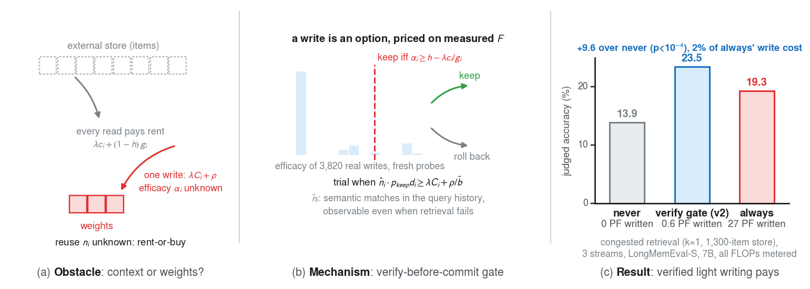
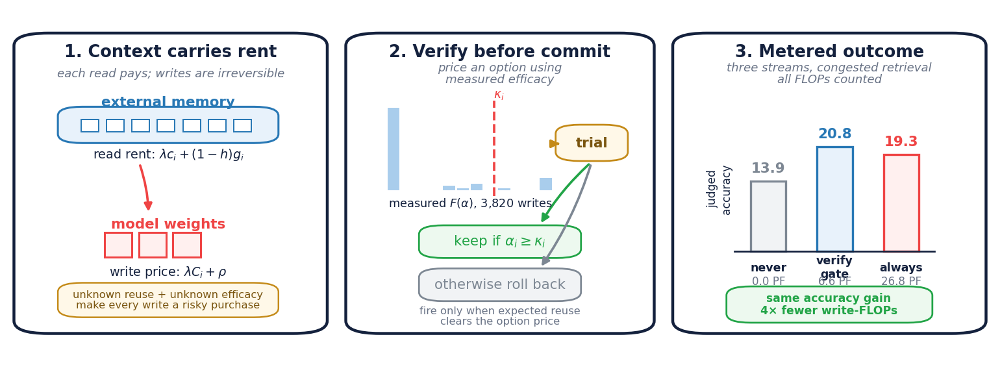
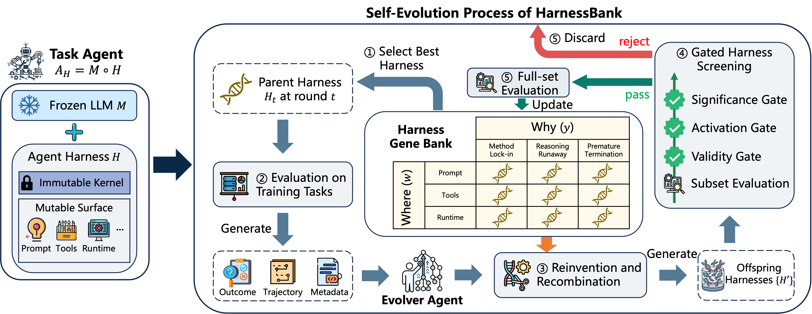
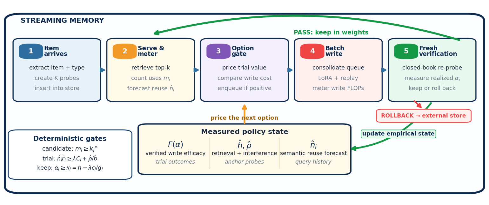
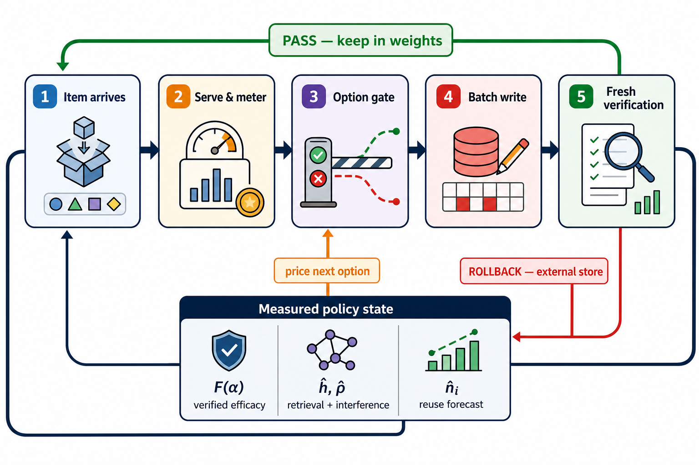
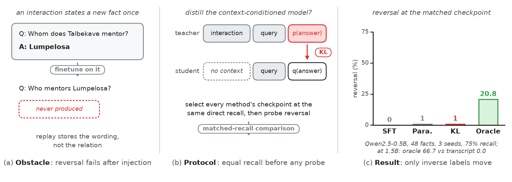
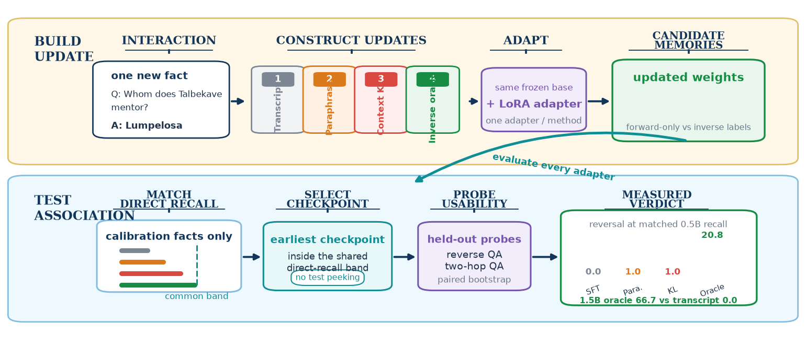

# AR Paper Figure Redesign Candidates

这些是版本化候选图。当前论文图片和 LaTeX 引用均未修改。候选资产与本页统一保存在当前目录 `./`，不会被正在运行的 Author 清理。生成脚本的快照保存在 `./scripts/`；重新运行时仍需原 Paper Task 中的实验 JSON 和 manifest。

## 1. When to Write to Weights — Teaser

风格参考：DASH Figure 2（三阶段机制图）。

### 当前版本

### V2 候选

- [矢量 PDF](./when-to-weights-teaser-v2.pdf)
- [生成脚本](./scripts/when-to-weights-teaser-v2.py)

## 2. When to Write to Weights — Streaming Gate

风格参考：HarnessBank Figure 2（闭环架构图）。

### 参考风格

### V2 候选

- [矢量 PDF](./when-to-weights-streaming-gate-v2.pdf)
- [生成脚本](./scripts/when-to-weights-streaming-gate-v2.py)

### Cursor Image 候选

#### V3 初稿

V3 的视觉质量较高，但红色 rollback 箭头错误地指向了 `Measured policy state`，不能直接用于论文。

#### V4 修正版

V4 已修正反馈语义：

- 红色 `ROLLBACK — external store` 回到 Stage 1 / external store。
- 绿色 `update empirical state` 从 Fresh verification 单独进入 policy state。
- 绿色 `PASS — keep in weights` 保持独立顶层回路。
- 橙色 `price next option` 从 policy state 指向 Option gate。

## 3. Self-Distillation — Framework Teaser

风格参考：SkillCorpus Figure 1（上层构建、下层使用与评估）。

### 当前版本

### V2 候选

- [矢量 PDF](./self-distillation-teaser-v2.pdf)
- [生成脚本](./scripts/self-distillation-teaser-v2.py)

## Verification

- 所有数据均从现有 JSON 结果和 manifest 读取。
- 三张 PDF 均为单页矢量输出。
- 宽度均为 7.00 inch。
- 字体为 Type 0/TrueType embedding；无 Type 3 字体。
- 未覆盖当前 Figure，未修改任何 LaTeX。

## Manual Review

### DASH-style Teaser V2

- Panel 标题、subtitle、柱图标签和底部结论框均无裁切或重叠。
- 13.9 / 20.8 / 19.3 accuracy 与 0.0 / 6.6 / 26.8 PFLOPs 由结果 JSON 读取。
- 最小字号在 7-inch `figure*` 下可读。
- 结论：可作为全宽 Teaser 候选。

### HarnessBank-style Streaming Gate V2

- 已重新统一五个阶段卡片的宽度、编号位置、标题基线和正文行距。
- 脚本执行文字 bounding-box 审计：`TEXT_AUDIT_OK (44 labels)`。
- PDF 已使用 Ghostscript 独立渲染并检查；无文字越界、标题裁切或穿过正文的长箭头。
- `update empirical state` 已右移并使用深色文字和浅绿色标签底；与左侧方框的实测间距为 `15.08pt`，高于 `6pt` 最低约束。
- `ROLLBACK → external store` 使用显式图层顺序：arrow `z=6`、box `z=9`、text `z=10`，确保标签框和文字始终绘制在红色箭头上方。
- Trial 条件已修正为论文中的
  `\hat n_i \tilde r_i \geq \lambda C_i + \hat\rho/\bar b`。
- 这是 7-inch 全宽图。若替换当前单栏 `fig:algo`，必须同时把 LaTeX 环境改为 `figure*`，否则缩放后字体不可读。
- 结论：可作为全宽 Streaming Gate 候选，不能直接塞入单栏环境。

### SkillCorpus-style Teaser V2

- 上下两条 lane、section heading、card 和箭头均按统一网格排列。
- Manifest 中的真实 fact 和两个 aggregate JSON 中的 reversal 数字由脚本读取。
- PDF 独立渲染后未发现裁切；底部方法标签较密，但在 7-inch `figure*` 下仍可读。
- 结论：可作为全宽 Framework Teaser 候选。
