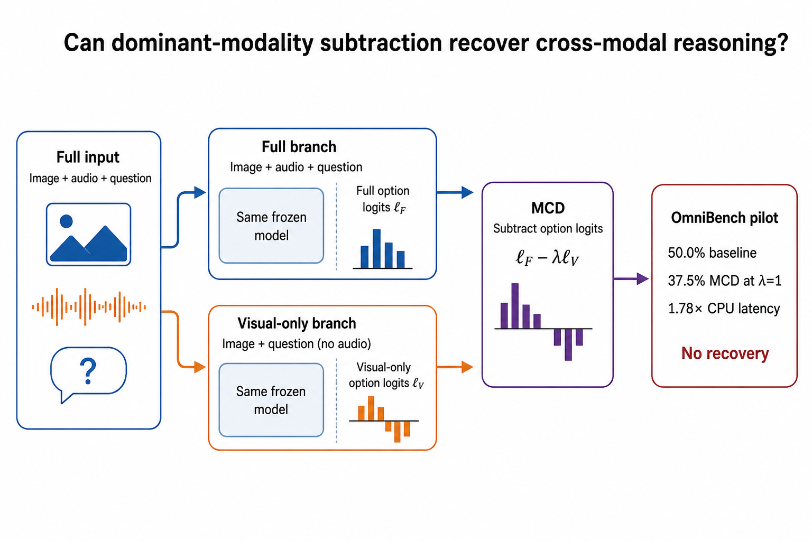
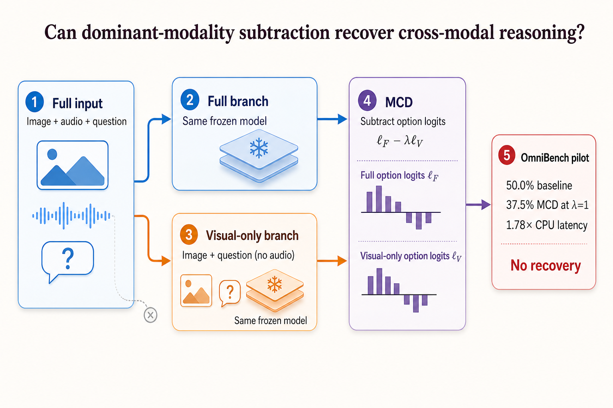
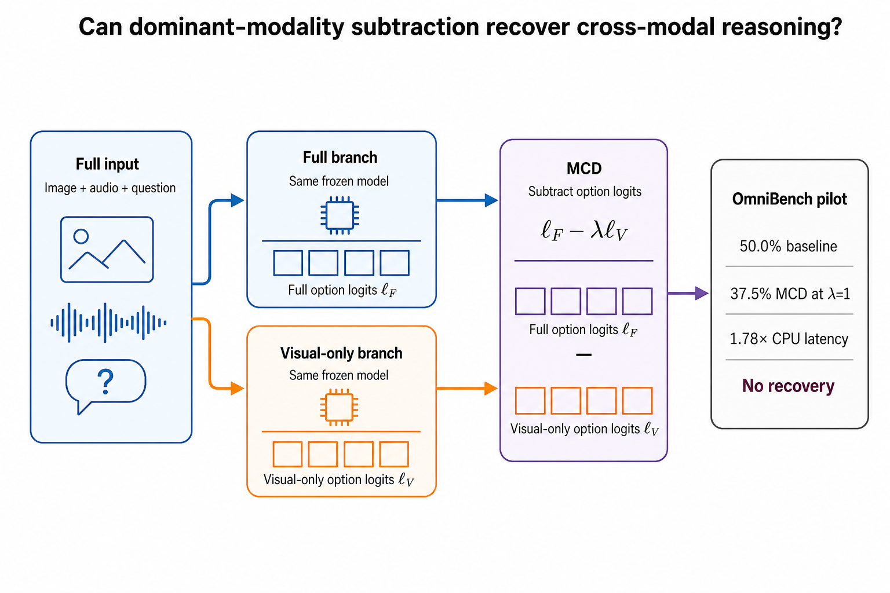
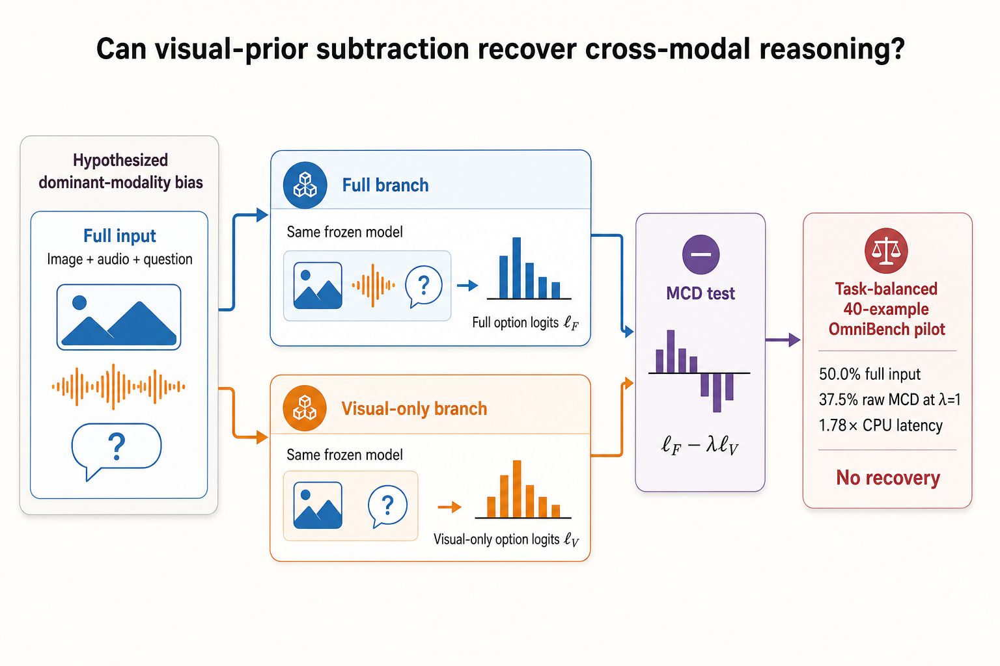
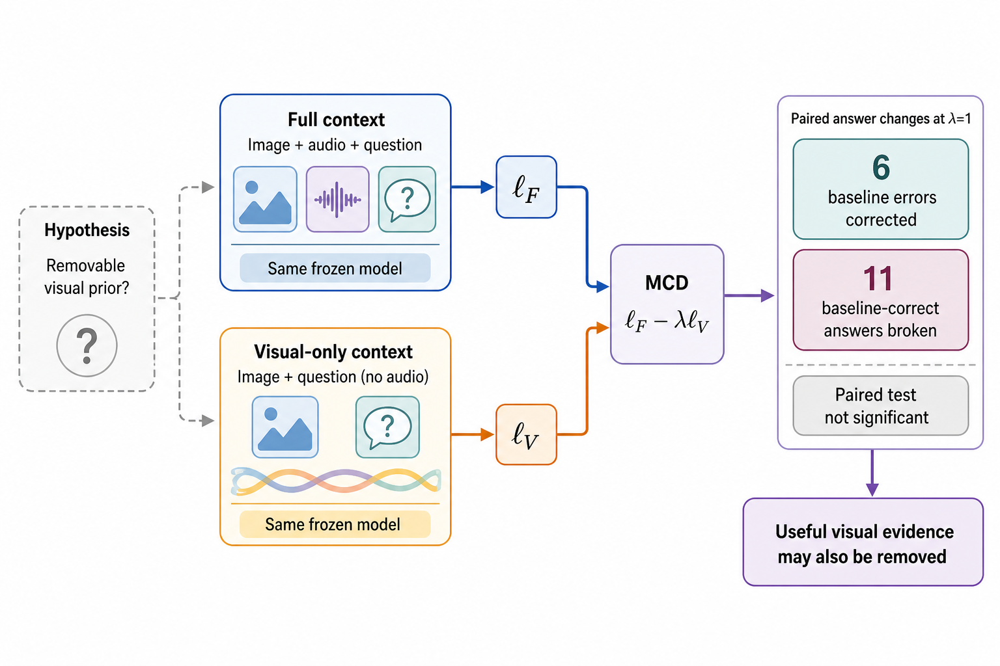
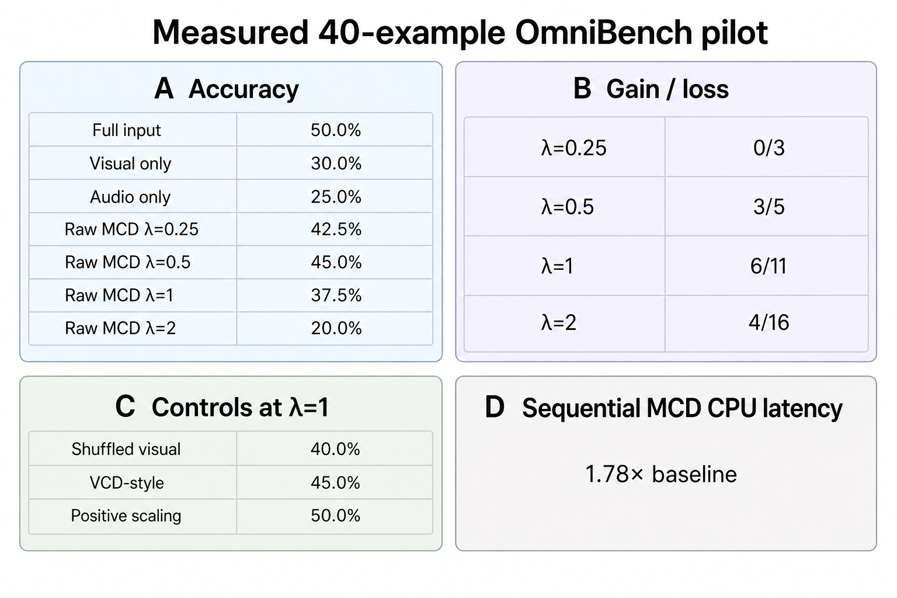
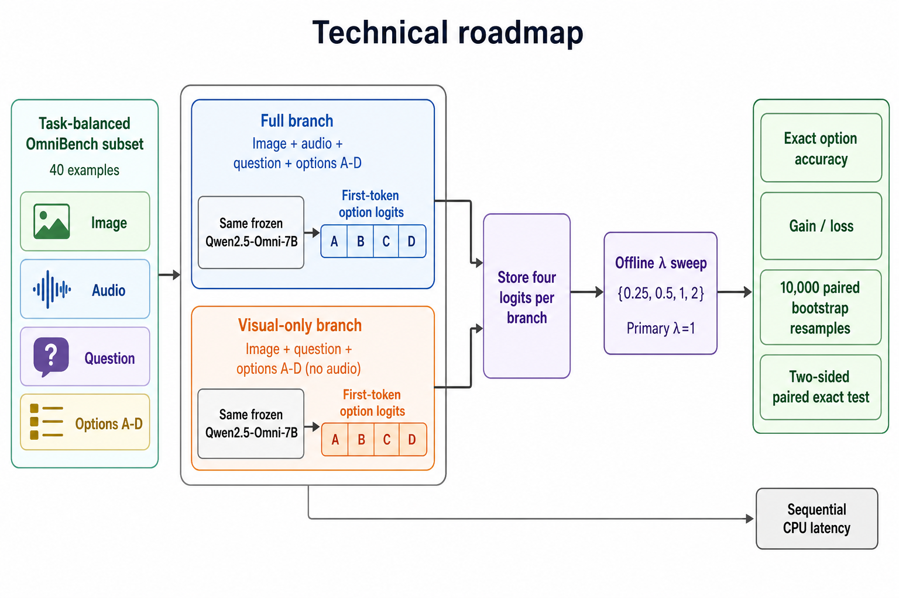

# Figure 1 Redraw — Happy Figure Skill Demo

Source paper:
`Testing Modality-Contrastive Decoding for Dominant-Modality Bias in Omnimodal Models`

Original Figure 1:
`loom-claude-paper/research-factory/.RUD/wacv3-modality-contrastive-decoding-removing-dominant-modality-bias-in-omnimoda/work/manuscript/figures/teaser.png`

## Variant 1 — Strict conference-paper figure

This is the most faithful candidate: the two branches, omitted audio in the
visual-only branch, subtraction direction, exact measurements, and restrained
“No recovery” conclusion are all explicit.

## Variant 2 — Premium academic graphical abstract

This version has the strongest visual polish. It preserves the core method and
measurements, but the image model added numbered badges `1–5` beyond the prompt
text whitelist.

## Variant 3 — Minimal flat vector schematic

This version is the cleanest and most compact. The lower route is correctly
visual-only, although the generated image omits the explicit
`Image + question (no audio)` supporting label.

## Additional figure-type directions

### Graphical abstract / paper main figure

Problem framing, the two-branch MCD test, and the measured no-recovery outcome
are combined into one polished overview.

### Mechanism explanation

This version explains the negative result directly: subtraction corrects six
baseline errors but breaks eleven baseline-correct answers, suggesting that
useful visual evidence may also be removed. The non-significant paired test is
shown explicitly.

### Multi-panel comparison

All committed accuracy, gain/loss, control, and latency values are presented as
equal-size text rows rather than model-invented quantitative charts.

### Technical roadmap

This version shows the reproducible evaluation protocol, including the
full/visual-only forwards, paired first-token logit storage, offline
`λ` sweep, statistical evaluation, and separate CPU timing path.

## Supporting artifacts

- [Complete reproducibility workflow](../HAPPY_FIGURE_REPRODUCTION_WORKFLOW.md)
- [Paper understanding and Figure brief](./paper-understanding.md)
- [Three Happy Figure Skill prompts](./prompts.md)
- [Four figure-type direction prompts](./direction-prompts.md)

All three images preserve the measured Figure 1 values:

- `50.0% baseline`
- `37.5% MCD at λ=1`
- `1.78× CPU latency`
- `No recovery`

The images are model-generated candidates and should still receive author
review before publication.
