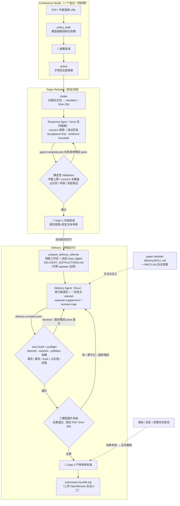

# Rebuttal Factory — Architecture

审稿意见应对流水线：Conference Studio（会议政策）→ Paper Rebuttal（逐点回复）
→ Delivery（修订终稿 + 一页 rebuttal + supplement + bundle）。双人工 Gate。

## 总图

## 入口与文件

| 层 | 位置 |
|---|---|
| 页面 | `/rebuttal-factory`（`loom/web_static/rebuttal_factory.html/js/css`）|
| API | `loom/web.py` 中 `/api/rebuttal/*` 路由 |
| 领域逻辑 | `loom/rebuttal_task.py`（Studio/项目/政策/验证/状态）|
| 交付 harness | `loom/rebuttal_delivery.py`（严格编译、preflight、图片验收、bundle）|
| 技能 | `loom/skills/ar/paper-rebuttal/SKILL.md`（回复起草）、`paper-rebuttal-delivery/SKILL.md`（终稿交付，通用）+ `WACV.md`（会议档案）|
| 注册表 | `~/.loom/rebuttal-projects.json`（version 2：studios + projects）|
| 项目产物 | `<paper-dir>/rebuttal-output/`（state.json、concerns、responses/、delivery/attempts/<run>/）|

## Conference Studio（一个会议一份政策）

状态机：`policy_input → policy_draft → await_policy_review →(🧑)→ active → closed`。
给定 CFP/作者指南 URL，headless 模型抽取结构化政策（字数上限、匿名、
是否允许修订稿、截止时间…），URL 抓取仅允许公网地址；人工批准后冻结，
该 Studio 下所有 paper 继承。

## Paper Rebuttal（回复内容）

状态机：`intake → concerns_ready → responses_ready → validated →(🧑 Gate 1)→ approved`。

1. **入库**：递归扫描论文包，识别原稿/审稿 PDF，生成带 SHA-256 的 manifest。
2. **Response Agent**（tmux 实时面板，`_rebuttal_start_agent` + watcher）：
   把 meta-review 与每位 reviewer 原子化为 concern 矩阵（ID/严重度/所需证据），
   再起草逐点回复（acceptance-first、evidence-bounded），写 `agent-complete.json`
   收工，watcher 负责 ingest。
3. **确定性 Validation**（`validate_project`）：字符上限、concern 全覆盖、
   占位符、外链/邮箱、冻结稿件表述（"If accepted, we will…"）等。
4. **Gate 1（内容批准）**：绑定政策与全部回复文本的 SHA 摘要
   （`content_approval`）；此后任何相关改动都会使批准失效。

## Delivery（终稿交付）

状态机：`approved → delivery_agent_running → delivery_validating →
(await_delivery_approval | delivery_blocked) →(🧑 Gate 2)→ bundle_ready`。

1. **prepare_delivery_attempt**：隔离 attempt 工作区（拷贝源码 + 冻结输入
   摘要 `input_digest`），生成 `DELIVERY_INSTRUCTIONS.md`（含冻结政策 JSON、
   布局质量条款、operator 反馈——`rerun-delivery` 支持自定义 `feedback`）。
2. **Delivery Agent**（tmux）：按 `paper-rebuttal-delivery/SKILL.md`（venue 参数
   一律读政策，WACV 另读 `WACV.md`）同步修订稿、压一页官方模板 rebuttal
   （彩色复述句 + 编号证据）、维护单独 supplement、写 `revision-map.json`
   （每个 concern → 章节/页码），最后写 `delivery-complete.json`。
3. **ingest_delivery_completion**（确定性 harness）：丢弃 Agent 编译结果，
   `strict_build_pdf` 自建（latexmk→tectonic→pdflatex 三重后备，日志必须干净）；
   preflight：rebuttal 恰好 N 页、US Letter、匿名、无外链、无占位值、
   WACV track/Paper ID、**正文填满 `paper_body_page_limit` 且 References 在其后**、
   文件大小、revision-map 全覆盖；产物记录 SHA-256。
4. **verify_delivery_figures**：三模型面板逐图审查渲染质量，**全票通过**，
   报告绑定当前 revised-paper 的 SHA（换 PDF 自动作废）。
5. **Gate 2（产物批准，approve_delivery）**：校验 preflight 通过 + 图片验收
   非陈旧 + 内容摘要/源码摘要未漂移 + 产物哈希未变 → 确定性 zip 出
   `submission-bundle.zip`。上传 OpenReview 永远人工。

失败回路：preflight/验收失败的报告可喂回同一 Delivery Agent pane 迭代
（运维脚本 `delivery_monitor.py` 模式），或 `rerun-delivery` 起新 attempt。

## API 面（常用）

`GET /api/rebuttal/catalog|studios|projects`、Studio：`policy`（抓取/草案）、
`approve-policy`、`DELETE studios/<id>`；项目：`start-agent|stop-agent`、
`validate`、`approve`（Gate 1，自动接 `start-delivery`）、`start-delivery|
rerun-delivery|stop-delivery`、`approve-delivery`（Gate 2）、
`GET delivery/<artifact>`（revised-paper/rebuttal/supplement/bundle 下载）、
`DELETE projects/<id>`（注销注册，源材料与 rebuttal-output 保留在磁盘）。
