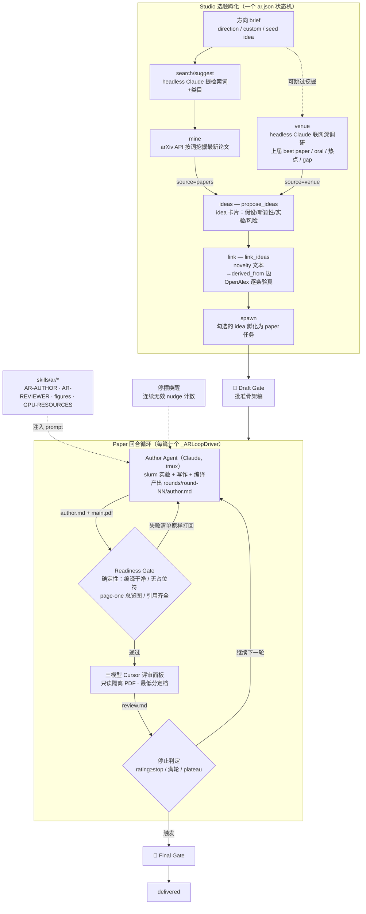

# Research Factory — Architecture

自动科研的选题与产文流水线：Studio（选题孵化）→ Paper（回合制写作循环）。
本文以代码为锚，配合总览文档 `docs/AUTO_RESEARCH_SYSTEM_DESIGN.md` 阅读。

## 总图

## 入口与文件

| 层 | 位置 |
|---|---|
| 页面 | `/factory`（`loom/web_static/factory.html` + `factory.js` + `factory.css`）|
| API | `loom/web.py` 中 `/api/tasks/<slug>/ar*` 系列路由 |
| 领域逻辑 | `loom/ar_task.py`（状态、挖掘、ideation、readiness、评审面板）|
| 任务基建 | `loom/rud_task.py`（任务注册、worktree、tmux agent 命令）|
| 技能 | `loom/skills/ar/`（角色技能 / 通用论文技能 / venue 专用技能 / figures/*）|
| 实例存储 | `<factory-root>/.RUD/<slug>/`（`ar.json` 状态 + `rounds/` + `work/`）|

同一个 `ar.json` 按 `role` 字段区分两种实体：`studio` 与 `paper`。

## 技能库（`loom/skills/ar/`）

技能是 Markdown 文件、方法论即代码：改文件即升级所有 Agent，无需改 Python。
按用途分七类，注入方式各不相同：

**① 角色方法论**（整篇注入对应角色的每个 prompt，`ar_skill_text`）

| 技能 | 角色 | 内容 |
|---|---|---|
| `AR-STUDIO.md` | 选题 | 方向 → 可证伪 idea 卡片的标准：每个 idea 必须有假设/新颖性论证/实验/风险 |
| `AR-AUTHOR.md` | 作者 | 一轮之内的完整纪律：实验先行、占位符规则、readiness 自检、何时交 `author.md` |
| `AR-REVIEWER.md` | 评审 | 以顶会 PC 成员标准只读 PDF 评审，输出固定结构的分数与意见 |

**② 图表工艺**（菜单式：`figure_skills_block()` 只把"名字+一句话描述"注入
author prompt，Agent 需要哪个再自己读全文，控制 prompt 体积）

| 技能 | 工艺路线 |
|---|---|
| `teaser-figure-1` | 三联"问题/方法/结果"着色圆角盒矢量示意（Excalidraw 风），全矢量 PDF |
| `teaser-figure-2` | 无装饰会议惯用风（SAM / FlashAttention 风）：白底、画物体不画盒子、result panel 用真实测量图 |
| `teaser-figure-3` | Cursor GenerateImage（Nano Banana）生成图标丰富的管线/闭环图：确定性语义蓝图 + 参考图 + 人工箭头/文字审查迭代 |
| `teaser-figure-4` | Happy Figure 工作流:事实/文字锁定 + 多个视觉方向 + 渲染后逐项审计 |
| `results-figure-1` | house style 测量图:Okabe-Ito 配色、基线画成标注线而非图例、打印图中每个数字 |
| `results-figure-2` | 分布证据版（Nature 风）:均值旁摆出全部 replicate、参考线自带颜色、面板内统计 |
| `figures/display.md` | 各图表技能 example 效果速览页 |
| `figures/reference/` | 下载的参考论文 PDF 与抽取图,供风格迁移对照 |

**③ 质量核查**：`figures/checkbib` — 逐条引用验真（`\cite` → .bib → DOI/arXiv/
venue 实源核对），防造假引用混入提交。

**④ 基础设施纪律**（`gpu_resources_block()` 整篇注入 author prompt）：
`GPU-RESOURCES.md` — slurm 集群规范：禁止登录节点跑推理、sbatch 模板、
显存被野进程占用时的防御性 requeue 守卫。

**⑤ 通用结果报告与实验溯源**（整篇注入所有 Author prompt）：
`paper-results-reporting/SKILL.md` — 与投稿 venue 无关；多 seed 结果统一报告为
均值 ± 样本标准差，禁止从置信区间反推标准差；论文中不暴露 hash、主机名和
本地路径，完整 provenance 转存到未编入 PDF 的 `EXPERIMENT_DETAILS.md`。

**⑥ WSDM 投稿规范**（只整篇注入 WSDM Author prompt）：
`wsdm-submission-readiness/SKILL.md` — ACM 匿名 review 模板、九页技术正文边界、
Ethical Considerations 与 References 的页界、正文附录整合和
`appendix-backup.tex` 独立备份。该技能不负责统计口径，也不会注入其他 venue。

**⑦ Rebuttal 域技能**（物理上同在 `skills/ar/` 下，逻辑属 Rebuttal Factory，
见 `docs/rebuttal-factory/arch.md`）：`paper-rebuttal/`（回复起草）、
`paper-rebuttal-delivery/`（终稿交付通用方法论 + `WACV.md` 会议档案）。

## Studio（选题孵化）

状态要点（`new_studio_state`）：`direction/custom_direction/venue/mode/seed_idea`、
挖掘结果 `papers`、检索设置 `search_terms/search_categories`、上届调研
`venue_report`、idea 池 `ideas`，以及每个后台作业的 `<job>_status/<job>_error`。

后台作业（全部走 `_ar_run_async` 线程 + `ar-<job>.log` 进度日志 + 轮询）：

| 作业 | 路由 action | 实现 | 说明 |
|---|---|---|---|
| 检索词建议 | `search/suggest` | `suggest_search_settings` | headless claude 从 brief 生成关键词+类目，人可改 |
| arXiv 挖掘 | `mine` | `mine_papers` | arXiv API 按词+类目抓最新论文，`venue_only` 可过滤 |
| 上届调研 | `venue` | `research_venue_cycle` | headless claude 联网深调研 venue 上一届（best paper/oral/热点/gap），结果规范化后存 `venue_report` |
| idea 生成 | `ideas` | `propose_ideas` | 素材二选一：`source=papers`（挖掘列表）或 `source=venue`（上届报告）；也接受直接粘贴 idea 数组 |
| 引用接地 | `link` | `link_ideas` + OpenAlex | 把 novelty 文本读回结构化 `derived_from` 边并逐条验真 |
| 孵化 | `spawn` | `_ar_spawn_children` | 勾选的 idea 各自变成 paper 任务（独立 worktree + tmux Author）|

作业互斥由各路由的 busy 检查保证；服务重启时 `sweep_stale_jobs` 把卡在
`running` 的状态清成 error。前端"Ideas from last cycle"按钮做了自动接链：
报告缺失时先跑 `venue`，落地后自动以 `source=venue` 触发 `ideas`。

## Paper（回合制写作循环）

状态机：`draft → await_draft_review →(🧑)→ loop →(停止条件)→ await_final_review →(🧑)→ delivered`。

每轮节拍（`_ARLoopDriver`，`loom/web.py`）：

1. **Author**：Claude 常驻 tmux（`work/code` + `work/manuscript` 两个 worktree），
   收到 round prompt（上轮评审 + AR-AUTHOR 技能 + figure 技能菜单 + GPU 规范），
   做实验、改稿、重编译，写 `rounds/round-NN/author.md` 作为完成信号。
2. **Readiness Gate**（确定性，`review_readiness`）：编译干净、无占位符/TODO/`??`、
   章节实质完整、page-one 总览图存在、引用图文件齐全、无悬空引用。
   失败清单原样打回 Author 重做（`readiness_attempts`），不消耗评审。
3. **Reviewer Panel**（`run_reviewer`）：三个 Cursor 模型
   （`CURSOR_REVIEWER_MODELS`：GPT-5.6 Sol Max Fast / Fable 5 Thinking Max /
   Grok 4.5 High Fast）并行、只读隔离目录中的编译 PDF，产出结构化分数，
   **最低分定档**（`deciding_model`）。
4. **停止判定**：达到 `stop_rating`（默认 8）/ 跑满 `max_rounds` / 平台期
   （连续两轮结构性修复无提升）→ Final Human Gate。

停摆自愈：Author pane 空闲但未交 `author.md` 时按连续无效唤醒计数重发
prompt（来自 zhongzhu/dev 的 stall-recovery）。

## API 面（paper 常用）

`GET /ar`（全量 payload：state/loop/logs/actions/pane）、`POST /ar/loop/start|stop`、
`POST /ar/gate`（draft/final 批准）、`POST /ar/review`（手动触发一次评审）、
`POST /ar/build`、`GET /ar/pdf`、`DELETE /api/tasks/<slug>`（整任务真删除，
`rud_task.delete_task` 对 `.RUD/<slug>` 做 rmtree）。

## 前端结构（factory.js）

单文件三视图：`fleet`（全局统计 + Studio 列表）、`studio`（四步流水 +
idea 卡片 + 引用图）、`paper`（轮次时间线 + 评审分数 + Author pane 实时面板）。
6 秒轮询 `GET /ar`；列表/图仅在指纹变化时重建以保护滚动与选择。
