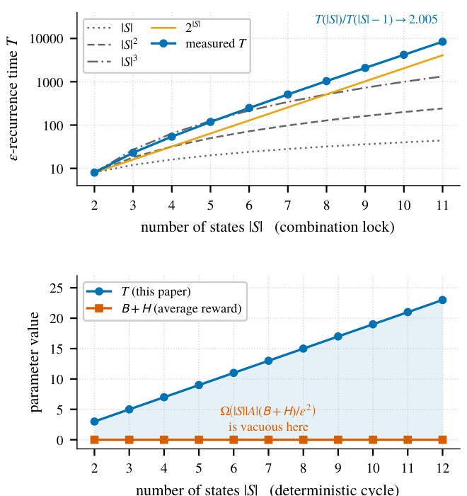
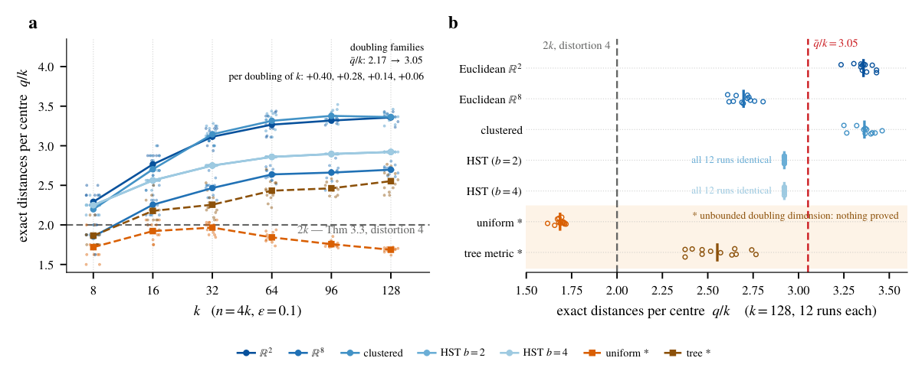
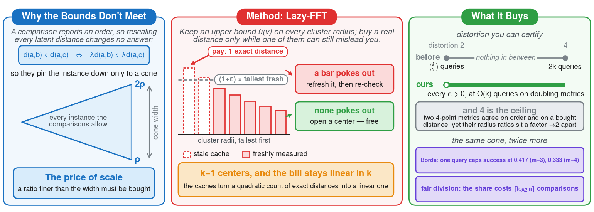
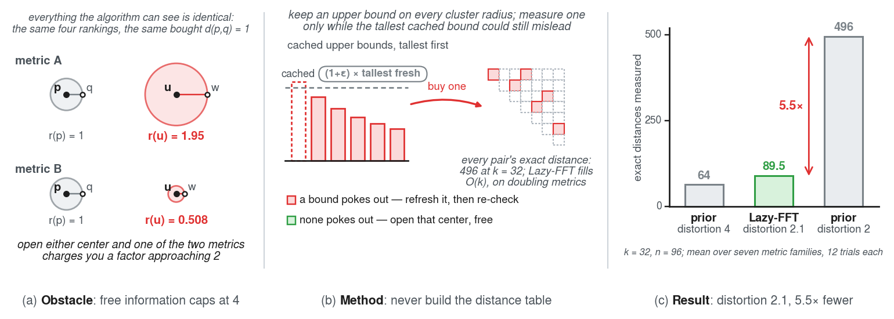
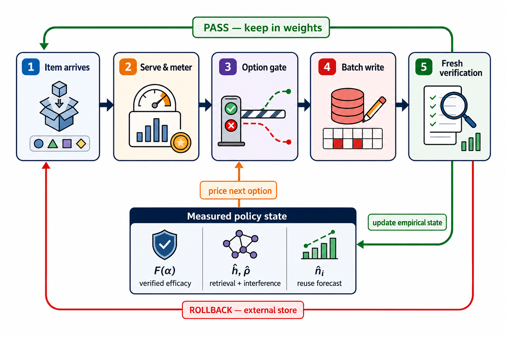

# AR Figure Skill Examples

本页通过相对路径直接引用每个 Figure Skill 自带的 `example.png`，不复制图片文件。

## Results Figure 1

[查看 Skill 文档](./results-figure-1/SKILL.md)

## Results Figure 2

[查看 Skill 文档](./results-figure-2/SKILL.md)

## Teaser Figure 1

[查看 Skill 文档](./teaser-figure-1/SKILL.md)

## Teaser Figure 2

[查看 Skill 文档](./teaser-figure-2/SKILL.md)

## Teaser Figure 3 — Default

[查看 Skill 文档](./teaser-figure-3/SKILL.md)

## Teaser Figure 4 — Happy Figure Workflow

[查看 Skill 文档](./teaser-figure-4/SKILL.md)

