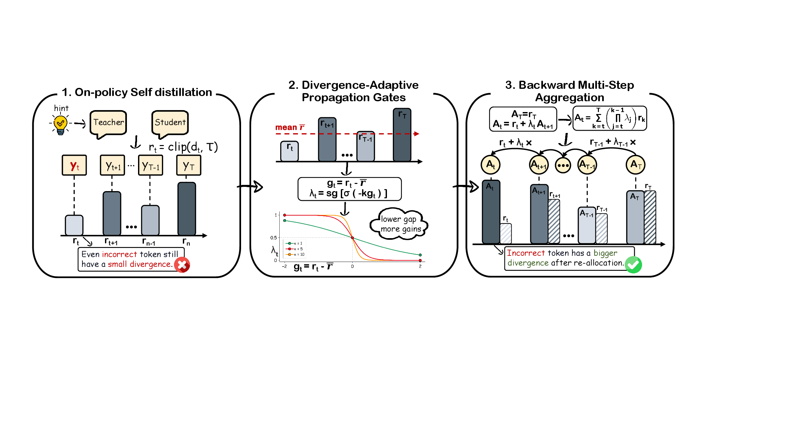
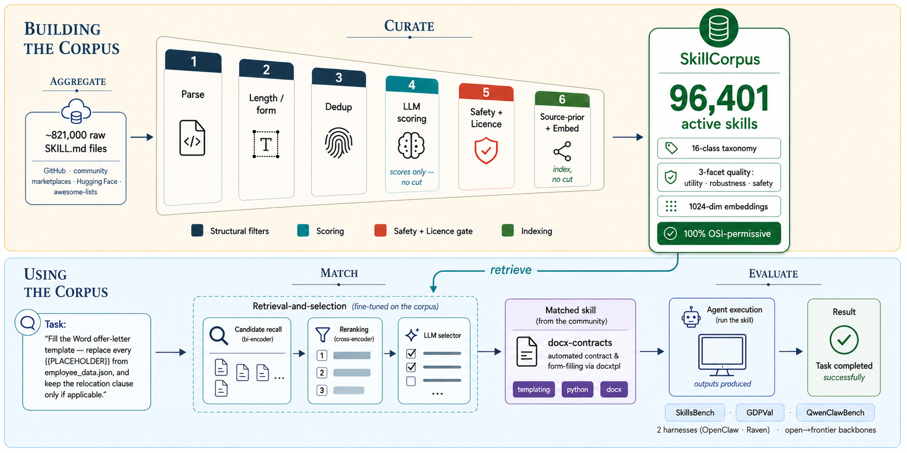

# Extracted Paper Figure References

这些文件直接来自对应 arXiv `e-print` 源码包。PNG/PDF 原始资产保持不变；DASH 额外生成了一张 PNG 预览。

## DASH — Figure 2

ArXiv: [2608.06243](https://arxiv.org/abs/2608.06243)

- [作者上传的矢量 PDF](./dash-2608.06243-figure-2.pdf)
- [PNG 预览](./dash-2608.06243-figure-2.png)

## HarnessBank — Figure 2

ArXiv: [2607.13683](https://arxiv.org/abs/2607.13683)

- [作者上传的原始 PNG](./harnessbank-2607.13683-figure-2.png)

## SkillCorpus — Figure 1

ArXiv: [2607.15557](https://arxiv.org/abs/2607.15557)

- [作者上传的原始 PNG](./skillcorpus-2607.15557-figure-1.png)

